# [Introduction to Flow Matching and Diffusion Models 2026, MIT](https://diffusion.csail.mit.edu/2026/index.html)

- **Created**: 2026-08-04
- **Last Updated**: 2026-08-25
- **Status**: `In Progress`
- **Related**:
  - [[diffusion]] — Broader reading list covering the foundations, objectives, architectures, and applications of diffusion models.

---

- **Course**: <https://diffusion.csail.mit.edu/2026/index.html>
- [Lecture Notes](assets/course-mit-diffusion-2026/lecture-notes.pdf)

---

| Done | Lecture | Topic | Slides | Recording | Lecture Notes | Lab | Additional Material |
| :--: | :--: | --- | :--: | :--: | --- | --- | --- |
| ☑ | 1 | **[Flow and Diffusion Models](#lecture1-flow-and-diffusion-models)** • Introduction to generative models • Ordinary and stochastic differential equations • Sampling from flow and diffusion models | [slides](assets/course-mit-diffusion-2026/lecture-01-flow-and-diffusion-models.pdf) | [recording](https://www.youtube.com/watch?v=9eJQQVrUUoI) | [§§1-2](assets/course-mit-diffusion-2026/lecture-notes.pdf) [Appendix A: A Reminder on Probability Theory](assets/course-mit-diffusion-2026/lecture-notes.pdf#page=70) | [Lab 1: ODEs and SDEs](https://colab.research.google.com/drive/18W-IB1QwdK7zuKlWrx5uB76FM-9Ak3eW?usp=sharing) | • [3blue1brown: ODEs](https://www.3blue1brown.com/lessons/differential-equations/) • [3blue1brown: PDEs](https://www.3blue1brown.com/lessons/pdes/) |
| ☑ | 2 | **[Flow Matching](#lecture2-flow-matching)** • Conditional and marginal probability path • Conditional and marginal vector field • Flow matching training objective | [slides](assets/course-mit-diffusion-2026/lecture-02-flow-matching.pdf) | [recording](https://www.youtube.com/watch?v=PNkMKWW8Khw) | [§3](assets/course-mit-diffusion-2026/lecture-notes.pdf) [Appendix B: A Proof of the Fokker-Planck Equation](assets/course-mit-diffusion-2026/lecture-notes.pdf#page=72) | [Lab 2: Flow and Score Matching](https://colab.research.google.com/drive/1Rb9pjn-lEH2r9F0UvIos7W0IWsBUs_kX?usp=sharing) | • [Mario Gemoll: Flow Matching](https://mariogemoll.com/flow-matching) • [Khan Academy: Divergence](https://www.khanacademy.org/math/multivariable-calculus/multivariable-derivatives/divergence-and-curl-articles/a/divergence) • [Khan Academy: Intuition for the Divergence Formula](https://www.khanacademy.org/math/multivariable-calculus/multivariable-derivatives/divergence-and-curl-articles/a/intuition-for-divergence-formula) • [Greg Wayne: Flow Matching Notes](../flourish/assets/2026-greg-wayne-sessions/Notes_Flow_Matching.pdf) |
| ☑ | 3-A | **[Score Functions and Score Matching](#lecture3-a-score-functions-and-score-matching)** • Score functions • Denoising score matching • SDE sampling | [slides](assets/course-mit-diffusion-2026/lecture-03-score-matching-and-guidance.pdf) | [recording](https://www.youtube.com/watch?v=ngC3QnYSVNM) | [§4](assets/course-mit-diffusion-2026/lecture-notes.pdf) | [Lab 2: Flow and Score Matching](https://colab.research.google.com/drive/1Rb9pjn-lEH2r9F0UvIos7W0IWsBUs_kX?usp=sharing) | • [Mario Gemoll: Diffusion](https://mariogemoll.com/diffusion) |
| ☑ | 3-B | **[Classifier-free Guidance](#lecture3-b-classifier-free-guidance)** • Guided generation • Classifier guidance • Classifier-free guidance | [slides](assets/course-mit-diffusion-2026/lecture-03-score-matching-and-guidance.pdf) | [recording](https://www.youtube.com/watch?v=8oWZ1bHwyRI) | [§5](assets/course-mit-diffusion-2026/lecture-notes.pdf) | — | — |
| ☐ | 4 | **Latent Spaces and Neural Network Architectures** • Variational autoencoders and latent spaces • Diffusion Transformer and U-Nets • Case studies: Large-scale models | [slides](assets/course-mit-diffusion-2026/lecture-04-latent-spaces-and-neural-network-architectures.pdf) | [recording](https://www.youtube.com/watch?v=g0MB1CCBmsI) | [§6](assets/course-mit-diffusion-2026/lecture-notes.pdf) [Appendix D: Additional Perspectives on VAEs](assets/course-mit-diffusion-2026/lecture-notes.pdf#page=77) | [Lab 3: Diffusion Transformer and VAEs](https://github.com/eje24/iap-diffusion-labs/blob/2026/labs/lab_three.ipynb) | — |
| ☐ | 5 | **Discrete Diffusion Models** • Continuous-time Markov chains (CTMCs) • Sampling from CTMC models • Training CTMC models | [slides](assets/course-mit-diffusion-2026/lecture-05-discrete-diffusion-models.pdf) | [recording](https://www.youtube.com/watch?v=d0kmyEJN2hI) | [§7](assets/course-mit-diffusion-2026/lecture-notes.pdf) [Appendix C: Existence and Uniqueness of Continuous-time Markov Chains](assets/course-mit-diffusion-2026/lecture-notes.pdf#page=74) | — | — |
| ☐ | — | **A Guide to the Diffusion Model Literature** | — | — | [Appendix E](assets/course-mit-diffusion-2026/lecture-notes.pdf#page=81) | — | — |

---

## [Lecture1] Flow and Diffusion Models

### Generative Modeling as Sampling

_**TL;DR:** Represent an object as a point in a high-dimensional space, represent plausible objects by a probability distribution over that space, and define generation as drawing a new point from that distribution._

The central direction of travel is:

$$
\text{simple noise} \longrightarrow \text{structured data}.
$$

Destroying structure by adding noise is easy. Generative modeling asks us to learn the much harder reverse transformation: starting from something easy to sample, such as Gaussian noise, produce a plausible image, video, or molecule.

The first abstraction is to represent each object numerically as a vector $z \in \mathbb{R}^d$:

- An RGB image with height $H$ and width $W$ is an array in $\mathbb{R}^{H \times W \times 3}$, which can be flattened into a vector with $d = 3HW$ coordinates.
- A video with $T$ frames is an element of $\mathbb{R}^{T \times H \times W \times 3}$.
- A simple representation of a molecule with $N$ atoms is an element of $\mathbb{R}^{3 \times N}$ containing the atoms' spatial coordinates.

The ambient space $\mathbb{R}^d$ contains every possible assignment of coordinates, including mostly meaningless images or physically impossible molecules. Plausible data occupies only a highly structured part of this space. We express that structure with an unknown data distribution $p_{\mathrm{data}}$.

Generation then means sampling

$$
z \sim p_{\mathrm{data}}.
$$

This formulation preserves diversity. There is no single best image of a dog; there are many valid samples, and $p_{\mathrm{data}}$ describes how the probability mass is distributed among them. Strictly, for continuous data, $p_{\mathrm{data}}(z)$ is a **density**, not the probability of the exact point $z$; probabilities are obtained by integrating the density over regions.

We do not know $p_{\mathrm{data}}$ directly. We only have a finite dataset that is modeled as iid draws:

$$
z_1,\ldots,z_N \overset{\mathrm{iid}}{\sim} p_{\mathrm{data}}.
$$

The dataset is therefore evidence about the distribution, not the distribution itself. The learning problem is to construct an algorithm that can produce new samples distributed approximately like the population that generated the dataset, rather than merely return training examples.

For conditional generation, the target distribution also depends on conditioning information $y$:

$$
z \sim p_{\mathrm{data}}(\cdot \mid y).
$$

Here $y$ might be a text prompt, class label, another image, or some scientific constraint. Unconditional generation learns what objects are plausible; conditional generation restricts plausibility to objects compatible with $y$. The underlying sampling machinery can be studied first without conditioning and extended later.

**Connection to language models.** An autoregressive language model also defines generation as sampling, but over a discrete sequence:

$$
p(x_{1:L}) = \prod_{i=1}^{L} p(x_i \mid x_{<i}).
$$

It generates one token at a time from these conditional distributions. The models in this course instead focus mainly on continuous vectors and generate by evolving an entire state through continuous time. Section 7 later returns to discrete diffusion for text.

### From Sampling to Continuous Dynamics

_**TL;DR:** Begin with a sample from an easy distribution and move it continuously so that the population of endpoints follows the data distribution._

Directly sampling from the unknown, complicated $p_{\mathrm{data}}$ is hard. Sampling from a simple initial distribution is easy, usually

$$
X_0 \sim p_{\mathrm{init}},
\qquad
p_{\mathrm{init}} = \mathcal{N}(0,I_d).
$$

We would like to construct a continuous evolution from time $t=0$ to $t=1$ such that

$$
X_0 \sim p_{\mathrm{init}}
\quad\Longrightarrow\quad
X_1 \sim p_{\mathrm{data}}.
$$

The interval $[0,1]$ is just a convenient convention. Here $t$ is **generative time** or **noise time**, not necessarily physical time. For a video, for example, the coordinates of $X_t$ already contain the video's frame-time dimension; the subscript $t$ describes how the whole video sample is being transformed by the generative process.

There are two main ways to specify this evolution:

- A **flow model** uses an ordinary differential equation (ODE), giving a deterministic trajectory once $X_0$ is fixed.
- A **diffusion model** uses a stochastic differential equation (SDE), injecting additional randomness throughout the trajectory.

The common idea is iterative generation: many simple local changes compose into a complicated global transformation from noise to data.

### ODEs: Trajectories, Vector Fields, and Flows

_**TL;DR:** A vector field gives the instantaneous velocity at every state and time; solving its ODE produces trajectories, and the flow collects the trajectories for every possible starting state._

A **trajectory** is a time-indexed position:

$$
X : [0,1] \to \mathbb{R}^d,
\qquad
t \mapsto X_t.
$$

A **time-dependent vector field** assigns a velocity to every possible position and time:

$$
u : \mathbb{R}^d \times [0,1] \to \mathbb{R}^d,
\qquad
(x,t) \mapsto u_t(x).
$$

The vector $u_t(x)$ answers a local question: _if the state were at $x$ at time $t$, in which direction and how quickly should it move?_ It does not directly tell us the final destination.

Given a fixed initial state $x_0$, the solution of the initial-value problem is one trajectory $X$. The ODE requires this trajectory's instantaneous velocity to equal the vector field evaluated at its current location:

$$
\frac{dX_t}{dt} = u_t(X_t),
\qquad
X_0=x_0.
$$

The dependence $u_t(X_t)$ is important. As $X_t$ moves, it enters a new part of the field, receives a new velocity, and bends accordingly. This is the higher-dimensional version of a slope field: arrows describe local derivatives, while a solution curve follows those arrows.

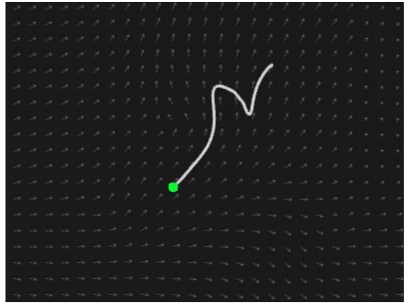

_A trajectory follows the local arrows as it moves through the field. Source: [Mario Gemoll's interactive visualization](https://mariogemoll.com/flow-matching), via the [MIT Lecture 1 slides](https://diffusion.csail.mit.edu/2026/docs/20260120_Lecture_01.pdf)._

The same equation can be written in integral form:

$$
X_t
=
x_0 + \int_0^t u_s(X_s)\,ds.
$$

This says that the current position equals the starting position plus all the infinitesimal displacements accumulated so far. It is also the form from which numerical solvers such as Euler's method follow naturally.

The **flow** gathers the trajectories for every possible initial state into one solution operator:

$$
\psi : \mathbb{R}^d \times [0,1] \to \mathbb{R}^d,
\qquad
(x_0,t) \mapsto \psi_t(x_0),
$$

where

$$
\boxed{X_t=\psi_t(X_0)=\psi_t(x_0)}.
$$

Thus, after fixing $x_0$, the function $t\mapsto\psi_t(x_0)$ is exactly that initial point's solution trajectory. Because this must hold for every $x_0$, the flow satisfies

$$
\frac{d}{dt}\psi_t(x_0)
=
u_t\!\left(\psi_t(x_0)\right),
\qquad
\psi_0(x_0)=x_0
\qquad
\text{for every }x_0.
$$

This resolves the apparently competing terminology in the lecture notes: the **trajectory is the individual solution for one initial condition**, while the **flow is the family, or solution operator, containing the solutions for all initial conditions**. It is common to call the flow a solution of the ODE as shorthand because $t\mapsto\psi_t(x_0)$ obeys the ODE for each fixed $x_0$.

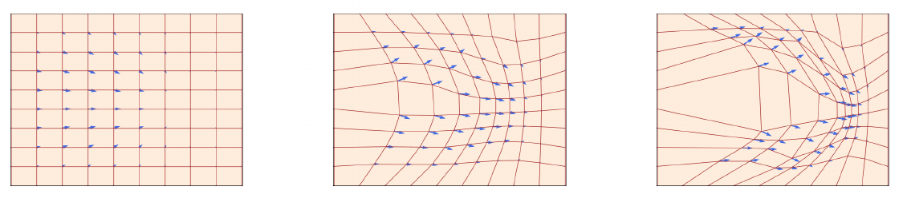

_The blue arrows specify local velocities; integrating them progressively warps the entire red grid. Source: [Lipman et al., Flow Matching Guide and Code](https://arxiv.org/abs/2412.06264), reproduced as Figure 1 in the MIT lecture notes._

For a random initial condition $X_0$, we select one of these trajectories at random:

$$
X_t=\psi_t(X_0).
$$

The three concepts differ mainly in viewpoint:

- $u_t(x)$ is the full field of local instructions.
- $X_t$ is one solution path obtained from one fixed initial condition $X_0=x_0$.
- $\psi_t$ maps every possible $x_0$ to its position at time $t$, so it collects all the solution paths.

In the wind analogy, $u_t(x)$ is the wind velocity everywhere, $X_t$ is the path of one balloon released at $x_0$, and $\psi_t$ is the map saying where a balloon released from every possible starting point would be at time $t$.

So the causal chain is

$$
\text{vector field}
\longrightarrow
\text{ODE}
\longrightarrow
\text{flow}.
$$

The model will eventually learn or parameterize the **vector field**, while an ODE solver computes the resulting trajectory/flow. The neural network is not usually asked to output $X_1$ in a single jump.

### Existence, Uniqueness, and Invertibility

_**TL;DR:** A sufficiently regular vector field gives exactly one trajectory from each initial state, so the resulting finite-time flow is reversible._

The lecture notes give a convenient sufficient condition: if $u$ is continuously differentiable with bounded derivative, then the ODE has a unique flow $\psi_t$, and each finite-time map $\psi_t$ is a diffeomorphism—a differentiable, invertible warping of space with a differentiable inverse.

A slightly more general way to remember the relevant condition is that $u_t(x)$ should be sufficiently regular in time and **Lipschitz in $x$**:

$$
\lVert u_t(x)-u_t(y)\rVert
\leq
L\lVert x-y\rVert.
$$

This limits how abruptly nearby velocities can diverge. The practical consequences are more important here than the technical theorem:

- the same starting point cannot branch into multiple solutions;
- two distinct trajectories cannot collide at the same finite time and then continue as one, because running the ODE backward would violate uniqueness;
- knowing the endpoint and the vector field lets us integrate backward to recover the start;
- the flow can continuously warp, stretch, contract, and rotate space without tearing or gluing it.

These statements concern the exact ODE. A coarse numerical approximation may still introduce error or apparent crossings, which is one reason step size matters.

### Linear Vector Field Example

_**TL;DR:** The field $u_t(x)=-\theta x$ points toward the origin and produces exponential contraction._

Consider the time-independent linear vector field

$$
u_t(x)=-\theta x,
\qquad
\theta>0.
$$

Every arrow points opposite the current position, and its magnitude grows linearly with the distance from the origin. The proposed flow is

$$
\psi_t(x_0)=e^{-\theta t}x_0.
$$

It satisfies the initial condition because

$$
\psi_0(x_0)=e^0x_0=x_0,
$$

and it satisfies the ODE because

$$
\begin{aligned}
\frac{d}{dt}\psi_t(x_0)
&= \frac{d}{dt}\left(e^{-\theta t}x_0\right) \\
&= -\theta e^{-\theta t}x_0 \\
&= -\theta\psi_t(x_0) \\
&= u_t\!\left(\psi_t(x_0)\right).
\end{aligned}
$$

For every finite $t$, multiplication by $e^{-\theta t}>0$ remains invertible. Points approach the origin exponentially but reach it only in the limit $t\to\infty$, so finite-time invertibility is not contradicted.

### Simulating an ODE with Euler's Method

_**TL;DR:** Euler's method repeatedly freezes the current velocity for a short time and takes a straight step in that direction._

In general, we cannot compute the flow $\psi_t$ directly. Euler's method approximates it by dividing $[0,1]$ into $n$ short steps of size

$$
h=\frac{1}{n},
$$

and repeatedly applying

$$
\boxed{
X_{t+h}=X_t+h\,u_t(X_t)
}
\qquad
t=0,h,2h,\ldots,1-h.
$$

Here $u_t(X_t)$ is the current velocity, so $h\,u_t(X_t)$ is the displacement obtained by following that velocity for time $h$. Each step therefore:

1. reads the arrow at the current position;
2. moves a short distance in that direction;
3. advances time by $h$;
4. repeats until $t=1$.

Smaller steps usually follow a curved trajectory more accurately, but they require more vector-field evaluations. In a flow model, each evaluation is a neural-network forward pass, so accuracy is traded against sampling cost.

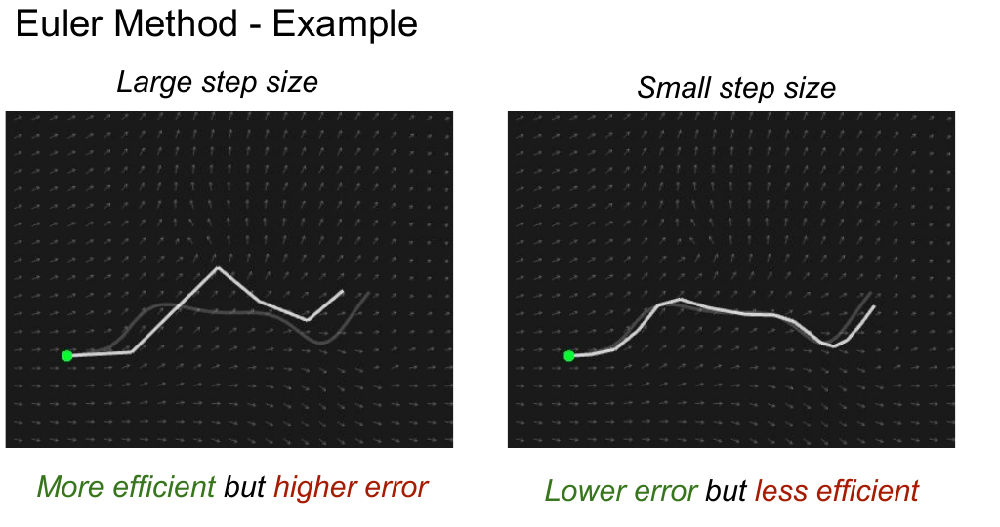

_A large step uses fewer field evaluations but follows the curved trajectory less accurately. Source: [Mario Gemoll](https://mariogemoll.com/flow-matching), via the [MIT Lecture 1 slides](https://diffusion.csail.mit.edu/2026/docs/20260120_Lecture_01.pdf)._

### Improving Euler with Heun's Method

_**TL;DR:** Euler uses only the velocity at the beginning of a step; Heun predicts the endpoint, evaluates the velocity there too, and moves using the average of the two velocities._

Euler uses the velocity at the beginning of the step for the entire update, so it can miss changes in direction. Heun's method first takes an Euler step to predict the endpoint:

$$
\widetilde{X}_{t+h}
=
X_t+h\,u_t(X_t).
$$

It then evaluates the velocity at that predicted endpoint and performs the actual update using the average of the two velocities:

$$
\boxed{
X_{t+h}
=
X_t+
\frac{h}{2}
\left[
u_t(X_t)
+
u_{t+h}\!\left(\widetilde{X}_{t+h}\right)
\right]
}.
$$

The two stages are therefore:

1. **Predict:** follow the initial arrow for one Euler step.
2. **Correct:** compare the initial arrow with the arrow at the predicted endpoint and use their average.

Heun usually follows curved trajectories more accurately than Euler at the same step size, but it requires two vector-field evaluations per step instead of one.

### Flow Models

_**TL;DR:** A flow model learns a neural vector field that deterministically transports a random draw from a simple initial distribution into a data sample._

We now parameterize the vector field with a neural network:

$$
u^\theta:
\mathbb{R}^d\times[0,1]
\to
\mathbb{R}^d,
\qquad
(x,t)\mapsto u_t^\theta(x),
$$

where $\theta$ denotes the network parameters. A flow model is the initial-value problem

$$
\boxed{
\begin{aligned}
X_0 &\sim p_{\mathrm{init}}, \\
\frac{dX_t}{dt} &= u_t^\theta(X_t).
\end{aligned}
}
$$

The ODE is deterministic **conditional on $X_0$**: fixing the initial noise fixes the entire trajectory and endpoint. The generated sample is nevertheless random because the initial state is random. Usually,

$$
p_{\mathrm{init}}=\mathcal{N}(0,I_d),
$$

although any distribution that is easy to sample at inference time could be used.

Let $\psi_t^\theta$ be the flow induced by $u_t^\theta$. Then

$$
X_t=\psi_t^\theta(X_0),
$$

and the distribution of states at time $t$ is the pushforward

$$
p_t^\theta
=
(\psi_t^\theta)_{\#}p_{\mathrm{init}}.
$$

The learning goal is to make the endpoint distribution equal, or closely approximate, the data distribution:

$$
\boxed{
X_1\sim p_{\mathrm{data}}
\quad\Longleftrightarrow\quad
\psi_1^\theta(X_0)\sim p_{\mathrm{data}}
}
$$

or equivalently

$$
p_1^\theta\approx p_{\mathrm{data}}.
$$

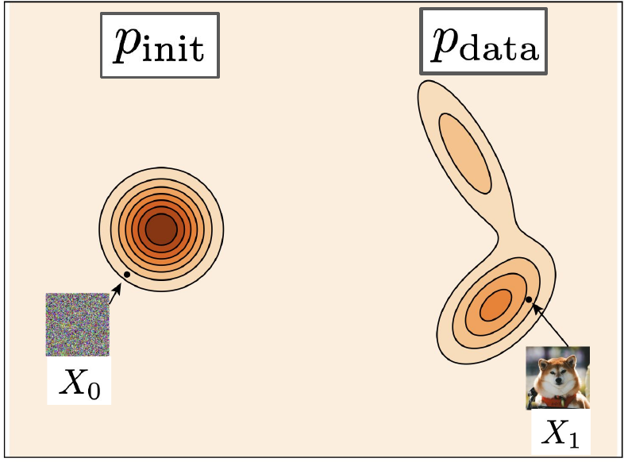

_The random initial sample $X_0$ comes from a simple distribution; the desired endpoint $X_1$ follows the structured data distribution. Figure credit: Yaron Lipman, from the [MIT Lecture 1 slides](https://diffusion.csail.mit.edu/2026/docs/20260120_Lecture_01.pdf)._

The source of randomness and the transformation play separate roles:

$$
\underbrace{X_0\sim p_{\mathrm{init}}}_{\text{random seed}}
\xrightarrow{\text{deterministic flow }\psi_1^\theta}
\underbrace{X_1}_{\text{generated sample}}.
$$

This is the same general pattern as a latent-variable generator $z\mapsto G_\theta(z)$: a deterministic function transforms a random latent variable into a random output. In a flow model, however, the transformation is defined implicitly by integrating a time-dependent vector field.

**The network parameterizes the vector field, not the flow.** A single evaluation of $u_t^\theta(x)$ produces only the instantaneous velocity at one state and time. The global map $\psi_t^\theta$ is obtained by repeatedly evaluating that network inside an ODE solver. Training must therefore learn suitable local velocities; numerical integration composes them into the final transformation.

**Sampling from a flow model with Euler's method.** Given $u_t^\theta$ and a number of steps $n$:

1. Set $t=0$ and $h=1/n$.
2. Draw $X_0\sim p_{\mathrm{init}}$.
3. For $n$ steps, update

   $$
   X_{t+h}=X_t+h\,u_t^\theta(X_t),
   \qquad
   t\leftarrow t+h.
   $$

4. Return $X_1$.

With Euler, sampling takes $n$ neural-network evaluations. The returned $X_1$ approximates $\psi_1^\theta(X_0)$; changing the numerical solver or step size changes the simulation error without changing the underlying learned continuous-time model.

At this point the remaining question is how to choose $\theta$ so that $p_1^\theta\approx p_{\mathrm{data}}$. Section 3 will answer that with flow matching. Section 2.2 first introduces the stochastic counterpart: diffusion models built from SDEs.

### Stochastic Processes and Random Trajectories

_**TL;DR:** An ODE assigns one trajectory to an initial point; an SDE assigns a distribution over trajectories because fresh randomness enters throughout the evolution._

For an ODE, fixing the initial condition $X_0=x_0$ fixes the complete trajectory. An SDE instead produces a **stochastic process**

$$
(X_t)_{0\leq t\leq 1}.
$$

There are two complementary ways to look at this object:

- For a fixed time $t$, $X_t$ is a random variable in $\mathbb{R}^d$ with some marginal distribution $p_t$.
- For one fixed outcome of all the randomness, $t\mapsto X_t$ is one random trajectory, or **sample path**.

More formally, a stochastic process is a function

$$
X:\Omega\times[0,1]\to\mathbb{R}^d,
\qquad
(\omega,t)\mapsto X_t(\omega),
$$

where $\omega\in\Omega$ represents one outcome of the random experiment. Holding $t$ fixed and varying $\omega$ gives the random variable $X_t$; holding $\omega$ fixed and varying $t$ gives one trajectory.

This distinction prevents a common confusion: the process is not one randomly chosen curve. It is the entire probabilistic rule that can produce many curves. Running the same SDE twice from the same $x_0$ can therefore produce different endpoints.

### Brownian Motion

_**TL;DR:** Brownian motion is continuous-time Gaussian noise: an interval of length $h$ contributes an independent Gaussian displacement with variance $h$ and therefore typical size $\sqrt{h}$._

A $d$-dimensional **Brownian motion**, or **Wiener process**, is a stochastic process $(W_t)_{t\geq0}$ satisfying:

1. It starts at the origin:

   $$
   W_0=0.
   $$

2. Its paths $t\mapsto W_t$ are continuous.

3. Its increments are Gaussian. For $0\leq s<t$,

   $$
   W_t-W_s\sim\mathcal{N}\!\left(0,(t-s)I_d\right).
   $$

4. Increments over disjoint time intervals are independent.

Taking $s=t$ and advancing by a small step $h$ gives

$$
W_{t+h}-W_t\sim\mathcal{N}(0,hI_d).
$$

Consequently, we can simulate its values on a time grid using

$$
\boxed{
W_{t+h}=W_t+\sqrt{h}\,\epsilon_t,
\qquad
\epsilon_t\sim\mathcal{N}(0,I_d)
}
$$

with a fresh independent $\epsilon_t$ at every step.

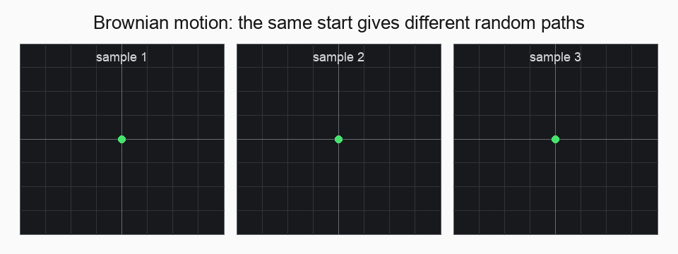

_The paths share the same initial point but use independent Gaussian increments. Locally rendered from the update above, adapted from [Mario Gemoll's Brownian-motion visualization](https://mariogemoll.com/flow-matching)._

**Why $\sqrt{h}$ rather than $h$?** Consider simulating one unit of time with $n=1/h$ independent increments. Because $\epsilon_t\sim\mathcal{N}(0,I_d)$, a single correctly scaled increment has variance

$$
\operatorname{Var}(\sqrt{h}\,\epsilon_t)=hI_d.
$$

Independent variances add, so after all $n$ steps the total variance is

$$
\frac{1}{h}\cdot hI_d=I_d.
$$

The alternatives fail as the step size shrinks:

- With $h\epsilon_t$, each step has variance $h^2I_d$, so the total variance is $hI_d\to0$: the randomness disappears.
- With unscaled $\epsilon_t$, each step has variance $I_d$, so the total variance is $I_d/h\to\infty$: the randomness explodes.

Thus $\sqrt h$ produces a finite, nonzero amount of randomness over a fixed time interval.

It also explains why Brownian motion is not differentiable. Over one short step, the deterministic drift in an SDE moves by a quantity proportional to $h$, while the Brownian increment typically has size proportional to $\sqrt h$:

$$
\text{drift displacement}\sim h,
\qquad
\text{Brownian displacement}\sim\sqrt h.
$$

Both go to zero as $h\to0$, which is compatible with a continuous path. But the Brownian finite-difference slope behaves like

$$
\frac{W_{t+h}-W_t}{h}
\stackrel{d}{=}
\frac{\epsilon_t}{\sqrt h}.
$$

Its standard deviation is $1/\sqrt h$, which diverges as $h\to0$. The path therefore remains continuous while its local slope never settles to a finite value; with probability one, Brownian paths are nowhere differentiable. An SDE must be interpreted through Brownian increments or stochastic integrals, not as an ODE containing an ordinary derivative $dW_t/dt$.

### From ODEs to SDEs

_**TL;DR:** An SDE combines a directed drift with Brownian spreading: locally it moves by $h$ times the drift plus $\sqrt h$ times fresh Gaussian noise._

Using a step size $h$, Euler simulates an ODE with the update

$$
X_{t+h}
=
X_t+h\,u_t(X_t).
$$

[Euler-Maruyama](#simulating-an-sde-with-euler-maruyama) simulates an SDE by adding a Brownian increment:

$$
X_{t+h}
=
X_t
+h\,u_t(X_t)
+\sigma_t(W_{t+h}-W_t).
$$

Because

$$
W_{t+h}-W_t
\stackrel{d}{=}
\sqrt h\,\epsilon_t,
\qquad
\epsilon_t\sim\mathcal N(0,I_d),
$$

the same update can be written as

$$
\boxed{
X_{t+h}
=
X_t
+h\,u_t(X_t)
+\sigma_t\sqrt h\,\epsilon_t
}.
$$

The continuous-time shorthand for these small-step dynamics is

$$
\boxed{
dX_t=u_t(X_t)\,dt+\sigma_t\,dW_t,
\qquad
X_0=x_0.
}
$$

The two terms have distinct roles:

- $u_t(X_t)\,dt$ is the **drift**. It gives the systematic local direction of travel.
- $\sigma_t\,dW_t$ is the **diffusion** term. The nonnegative coefficient $\sigma_t$ controls how strongly trajectories spread at time $t$.

A useful local interpretation is

$$
\mathbb{E}[X_{t+h}-X_t\mid X_t=x]
\approx
h\,u_t(x),
$$

and, for the scalar diffusion coefficient used in the notes,

$$
\operatorname{Cov}(X_{t+h}-X_t\mid X_t=x)
\approx
h\sigma_t^2I_d.
$$

Thus the drift describes the conditional mean displacement, while the diffusion coefficient describes the conditional covariance of the random displacement.

The $dX_t$ notation is symbolic shorthand for the small-step dynamics above; it should not be interpreted using an ordinary derivative $dW_t/dt$.

**What happened to the flow map?** An ODE has a deterministic map $x_0\mapsto\psi_t(x_0)$. For an SDE, $X_t$ is not determined by $x_0$ alone; it also depends on the Brownian path. One can define a random flow after fixing that Brownian path, but there is no single deterministic map of $x_0$ that gives every outcome.

### Existence and Uniqueness for SDEs

As in the ODE case, regularity assumptions prevent ambiguous dynamics. The notes use the sufficient conditions that $u$ is continuously differentiable with bounded derivative and $\sigma_t$ is continuous. Under these assumptions, the SDE has a unique solution.

Operationally, uniqueness means that if we fix both

$$
X_0=x_0
\quad\text{and}\quad
(W_t)_{0\leq t\leq1},
$$

the SDE determines one path $X_t$. Changing the Brownian realization changes the path; ambiguity in the differential equation does not.

Every ODE is the special case

$$
\sigma_t=0.
$$

The hierarchy is therefore

$$
\text{flow model}
\subset
\text{SDE model},
$$

with the flow model obtained by turning off stochasticity in the dynamics.

### Ornstein-Uhlenbeck Process

_**TL;DR:** The Ornstein-Uhlenbeck process balances an inward linear drift against continual Gaussian noise, producing a stationary Gaussian rather than collapsing to zero._

The lecture's main SDE example is

$$
\boxed{
dX_t=-\theta X_t\,dt+\sigma\,dW_t,
\qquad \theta>0.
}
$$

This is the **Ornstein-Uhlenbeck (OU) process**. Its two forces compete:

- The drift $-\theta X_t$ pulls the state toward zero. Farther points receive a stronger restoring force.
- The diffusion term $\sigma dW_t$ continually injects noise and spreads trajectories apart.

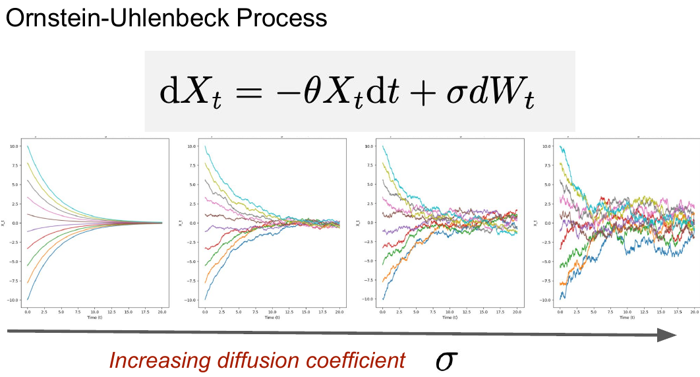

_As $\sigma$ increases from left to right, the restoring drift remains but the paths fluctuate more strongly. Source: [MIT Lecture 1 slides](https://diffusion.csail.mit.edu/2026/docs/20260120_Lecture_01.pdf)._

For a fixed initial state $X_0=x_0$,

$$
X_t
=e^{-\theta t}x_0+\sigma\int_0^t e^{-\theta(t-s)}\,dW_s
\sim\mathcal{N}\!\left(e^{-\theta t}x_0,\;\sigma^2\int_0^t e^{-2\theta(t-s)}\,ds\,I_d\right)
=\mathcal{N}\!\left(e^{-\theta t}x_0,\;\frac{\sigma^2}{2\theta}\left(1-e^{-2\theta t}\right)I_d\right)
\xrightarrow[t\to\infty]{d}
\mathcal{N}\!\left(0,\frac{\sigma^2}{2\theta}I_d\right).
$$

The first term is the fading memory of the initial state; the stochastic integral is the accumulated Gaussian noise. The inward drift keeps that accumulated noise from spreading the process without bound.

This limiting behavior explains the trajectories in Figure 3 of the lecture notes:

- With $\sigma=0$, all paths smoothly contract to zero, exactly as in the earlier linear ODE.
- With $\sigma>0$, trajectories keep fluctuating, but mean reversion prevents them from wandering arbitrarily far.
- Increasing $\sigma$ increases the equilibrium variance; increasing $\theta$ strengthens mean reversion and decreases it.

The OU process is a useful prototype for diffusion-model noising processes: the signal from the initial condition decays while Gaussian uncertainty accumulates.

### Simulating an SDE with Euler-Maruyama

_**TL;DR:** Euler-Maruyama is Euler's method plus a correctly scaled, independent Gaussian increment at every step._

Choose $n$ steps and set

$$
h=\frac1n.
$$

Replacing the Brownian increment by its exact grid distribution,

$$
W_{t+h}-W_t=\sqrt h\,\epsilon_t,
\qquad
\epsilon_t\sim\mathcal{N}(0,I_d),
$$

gives the **Euler-Maruyama** update

$$
\boxed{
X_{t+h}
=
X_t
+h\,u_t(X_t)
+\sigma_t\sqrt h\,\epsilon_t,
\qquad
\epsilon_t\sim\mathcal{N}(0,I_d).
}
$$

Compare the two numerical methods directly:

$$
\begin{aligned}
\text{Euler:}\qquad
X_{t+h}
&=X_t+h\,u_t(X_t),\\
\text{Euler-Maruyama:}\qquad
X_{t+h}
&=X_t+h\,u_t(X_t)+\sigma_t\sqrt h\,\epsilon_t.
\end{aligned}
$$

At each step:

1. Evaluate the drift at the current state.
2. Move a distance $h\,u_t(X_t)$ in that direction.
3. Draw a fresh independent $\epsilon_t$.
4. Add the random displacement $\sigma_t\sqrt h\,\epsilon_t$.

The independent Gaussian draw is part of simulating the modeled dynamics, not merely numerical error. Reusing the same $\epsilon$ at every step would create strongly correlated increments and would not simulate Brownian motion.

As with Euler's method, a smaller $h$ produces a more faithful approximation but requires more evaluations of the neural drift. Because Brownian paths are rough, the general strong convergence rate of Euler-Maruyama is lower than Euler's rate for smooth ODEs; the simulation still converges even though individual paths never become differentiable.

### Diffusion Models as SDE Generators

_**TL;DR:** A diffusion model learns the drift of an SDE whose endpoint distribution should match the data; sampling numerically evolves Gaussian noise while injecting fresh noise along the path._

The lecture now parameterizes the drift with a neural network

$$
u^\theta:
\mathbb{R}^d\times[0,1]
\to
\mathbb{R}^d,
\qquad
(x,t)\mapsto u_t^\theta(x),
$$

and treats the diffusion coefficient $\sigma_t$ as fixed. Its abstract diffusion model is

$$
\boxed{
\begin{aligned}
X_0&\sim p_{\mathrm{init}},\\
dX_t&=u_t^\theta(X_t)\,dt+\sigma_t\,dW_t.
\end{aligned}
}
$$

The objective is to choose $\theta$ so that

$$
X_1\sim p_{\mathrm{data}}.
$$

Euler-Maruyama sampling is:

1. Set $h=1/n$ and draw $X_0\sim p_{\mathrm{init}}$.
2. For $t=0,h,\ldots,1-h$:

   $$
   \epsilon_t\sim\mathcal{N}(0,I_d),
   $$

   $$
   X_{t+h}
   =
   X_t
   +h\,u_t^\theta(X_t)
   +\sigma_t\sqrt h\,\epsilon_t.
   $$

3. Return $X_1$.

Unlike a flow model, randomness now enters in two places:

$$
\underbrace{X_0\sim p_{\mathrm{init}}}_{\text{random initial state}}
\quad\text{and}\quad
\underbrace{dW_t}_{\text{fresh randomness during evolution}}.
$$

Setting $\sigma_t=0$ removes the second source and recovers the flow model exactly.

**What does the neural network predict?** In this abstract presentation, it directly parameterizes the SDE drift $u_t^\theta(x)$. Practical diffusion models are often trained to predict a score, noise $\epsilon$, velocity $v$, or clean data $x_0$ instead. Those quantities can be converted algebraically into the drift required by the sampler; §4 develops the score-based construction.

**Time-direction convention.** This lecture labels the generative direction as

$$
X_0\sim p_{\mathrm{init}}
\longrightarrow
X_1\sim p_{\mathrm{data}}.
$$

DDPM papers use the opposite time convention: $x_0$ is data and $x_1$ is noise, so generation runs from $t=1$ back to $t=0$. This is only a relabeling of time.

Lecture 1 has now specified what flow and diffusion generative models **are** and how to simulate them. It has not yet explained how to learn a drift that reaches $p_{\mathrm{data}}$: §3 introduces flow matching for deterministic flows, while §4 introduces score matching and reverse-SDE sampling for diffusion models.

## [Lecture2] Flow Matching

### From a Flow Model to a Training Problem

_**TL;DR:** A flow model can already turn an initial sample into an endpoint; flow matching supplies a tractable target vector field whose endpoint distribution is the data distribution._

Lecture 1 defined a flow model but did not say how to choose its neural vector field. The model is

$$
X_0\sim p_{\mathrm{init}},
\qquad
dX_t=u_t^\theta(X_t)\,dt,
$$

or equivalently

$$
\frac{dX_t}{dt}=u_t^\theta(X_t).
\tag{10}
$$

Generation means numerically simulating this ODE from $t=0$ to $t=1$ and returning $X_1$. Training must therefore choose $\theta$ so that

$$
X_0\sim p_{\mathrm{init}}
\quad\Longrightarrow\quad
X_1\sim p_{\mathrm{data}}.
$$

This is a distribution-level requirement: there is no distinguished correct endpoint for any particular initial noise sample. Many different flows can carry the same initial distribution to the same data distribution. Flow matching resolves this freedom by first choosing a convenient path of intermediate distributions and then constructing a vector field that realizes it.

Although this section trains a deterministic ODE, its Gaussian corruption paths will look almost identical to the noising formulas used in diffusion models. The later distinction is in the dynamics used for generation: flow matching here learns an ODE, whereas score-based diffusion constructs a reverse SDE or its associated probability-flow ODE.

### Conditional and Marginal Probability Paths

_**TL;DR:** A conditional path ends at one chosen datum $z$; mixing those paths over $z\sim p_{\mathrm{data}}$ gives the marginal path from noise to the full data distribution._

A **probability path** $(p_t)_{0\leq t\leq1}$ specifies the desired distribution of $X_t$ at every time. It describes a sequence of population snapshots, not how any particular particle moves between snapshots. A vector field, introduced below, supplies those dynamics.

For a fixed data point $z\in\mathbb R^d$, a conditional probability path $p_t(\cdot\mid z)$ satisfies

$$
p_0(\cdot\mid z)=p_{\mathrm{init}},
\qquad
p_1(\cdot\mid z)=\delta_z.
\tag{11}
$$

Here $\delta_z$ is the Dirac point mass: a sample from $\delta_z$ equals $z$ with probability one. Thus the conditional path starts with the same noise distribution for every $z$ and gradually collapses onto that one selected data point.

The word **conditional** means "for one fixed endpoint $z$." To recover the whole dataset distribution, first draw the endpoint and then draw a noisy point conditional on it:

$$
Z\sim p_{\mathrm{data}},
\qquad
X_t\sim p_t(\cdot\mid Z).
\tag{12}
$$

The resulting marginal density is

$$
p_t(x)
=
\int p_t(x\mid z)p_{\mathrm{data}}(z)\,dz.
\tag{13}
$$

"Marginal" means that the latent choice of $z$ has been averaged out. The [sampling construction above](#conditional-and-marginal-probability-paths) is tractable with a dataset: sample a training example and corrupt it. The corresponding [marginal-density integral](#conditional-and-marginal-probability-paths) is generally intractable because evaluating $p_t(x)$ requires integrating over all possible clean data points.

The endpoints follow directly from the conditional endpoints. At $t=0$,

$$
\begin{aligned}
p_0(x)
&=\int p_0(x\mid z)p_{\mathrm{data}}(z)\,dz\\
&=\int p_{\mathrm{init}}(x)p_{\mathrm{data}}(z)\,dz\\
&=p_{\mathrm{init}}(x),
\end{aligned}
$$

because $p_{\mathrm{data}}$ integrates to one. At $t=1$,

$$
\begin{aligned}
p_1(x)
&=\int \delta_z(x)p_{\mathrm{data}}(z)\,dz\\
&=p_{\mathrm{data}}(x).
\end{aligned}
$$

Therefore

$$
p_0=p_{\mathrm{init}},
\qquad
p_1=p_{\mathrm{data}}.
\tag{14}
$$

The conditional and marginal views are two levels of the same construction:

- $p_t(\cdot\mid z)$: what noisy versions of one particular $z$ look like at time $t$;
- $p_t$: what noisy versions of the entire data distribution look like at time $t$.

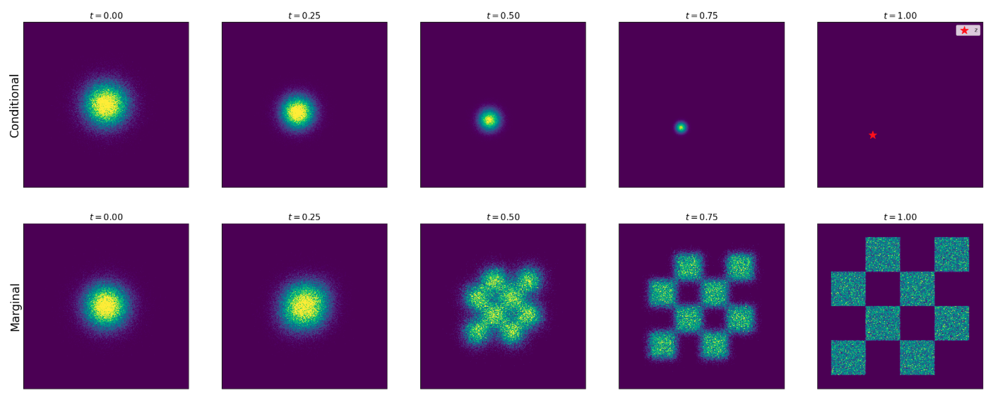

_The conditional path (top) contracts toward one fixed $z$; the marginal path (bottom) spreads toward the full data distribution as $z$ varies. Source: Figure 5 of the [lecture notes](assets/course-mit-diffusion-2026/lecture-notes.pdf)._

### The Gaussian Conditional Probability Path

_**TL;DR:** Form an intermediate sample by scaling a clean datum and a Gaussian-noise sample; changing their coefficients moves the distribution continuously from noise to data._

Let $\alpha_t$ and $\beta_t$ be differentiable schedules satisfying

$$
\alpha_0=0,
\quad
\alpha_1=1,
\qquad
\beta_0=1,
\quad
\beta_1=0.
$$

The Gaussian conditional path is

$$
p_t(\cdot\mid z)
=
\mathcal N(\alpha_tz,\beta_t^2I_d).
\tag{15}
$$

It can be sampled by

$$
Z\sim p_{\mathrm{data}},
\qquad
\epsilon\sim\mathcal N(0,I_d),
\qquad
X_t=\alpha_tZ+\beta_t\epsilon.
\tag{16}
$$

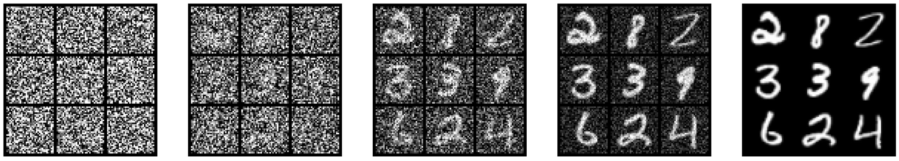

_As $t$ increases, $\alpha_t$ preserves more of each image and $\beta_t$ retains less Gaussian noise. Source: Figure 4 of the [lecture notes](assets/course-mit-diffusion-2026/lecture-notes.pdf)._

Conditioned on $Z=z$,

$$
\alpha_tz+\beta_t\epsilon
\sim
\mathcal N(\alpha_tz,\beta_t^2I_d),
$$

because scaling a standard Gaussian by $\beta_t$ gives covariance $\beta_t^2I_d$ and adding $\alpha_tz$ shifts its mean.

At the endpoints,

$$
X_0=\epsilon\sim\mathcal N(0,I_d),
\qquad
X_1=Z\sim p_{\mathrm{data}}.
$$

A particularly simple choice is the **conditional optimal transport**, or **CondOT**, schedule

$$
\alpha_t=t,
\qquad
\beta_t=1-t,
$$

which gives the straight interpolation

$$
X_t=tZ+(1-t)\epsilon.
$$

**Why is this called conditional optimal transport?** Fix one data point $z$. The conditional problem is then to move the initial Gaussian distribution to the point mass $\delta_z$. For each initial noise sample $\epsilon$, the minimum-energy path between the two fixed endpoints is the straight line

$$
\underset{\substack{x_0=\epsilon\\x_1=z}}{\operatorname{argmin}}
\int_0^1\left\|\frac{dx_t}{dt}\right\|^2\,dt
\quad\Longrightarrow\quad
x_t=tz+(1-t)\epsilon.
$$

It moves at the constant velocity

$$
\frac{dx_t}{dt}=z-\epsilon.
$$

Since $\epsilon\sim\mathcal N(0,I_d)$, the population of these straight trajectories has

$$
X_t\mid Z=z
\sim
\mathcal N\!\left(tz,(1-t)^2I_d\right),
$$

which is exactly the Gaussian path obtained from $\alpha_t=t$ and $\beta_t=1-t$. It is **conditional** OT because this argument is made separately for every fixed endpoint $z$.

This name does **not** imply that independently pairing $\epsilon\sim p_{\mathrm{init}}$ with $Z\sim p_{\mathrm{data}}$ gives the globally optimal transport coupling between the full noise and data distributions. The conditional trajectories are straight, but after averaging over all $z$, trajectories of the learned marginal vector field need not be straight or globally OT-optimal.

The original [Flow Matching paper](https://arxiv.org/abs/2210.02747) calls these **conditional OT paths**, while [Flow Matching Guide and Code](https://arxiv.org/abs/2412.06264) uses the shorthand **CondOT** and exposes `CondOTPath` and `CondOTScheduler` in its library. The term is therefore standard within flow matching, but not universal across generative modeling. Other presentations may say **straight-line path** or **linear interpolation path**; closely related rectified-flow work uses the same interpolation under its own terminology.

**Variance along the path.** Let

$$
X_t=\alpha_tZ+\beta_t\epsilon,
\qquad
\epsilon\sim\mathcal N(0,I_d),
$$

with $Z$ and $\epsilon$ independent. If $Z$ has mean $\mu_{\mathrm{data}}$ and covariance $\Sigma_{\mathrm{data}}$, then

$$
\mathbb E[X_t]=\alpha_t\mu_{\mathrm{data}}
$$

and

$$
\begin{aligned}
\operatorname{Cov}(X_t)
&=\operatorname{Cov}(\alpha_tZ+\beta_t\epsilon)\\
&=\alpha_t^2\operatorname{Cov}(Z)
+\beta_t^2\operatorname{Cov}(\epsilon)\\
&=\alpha_t^2\Sigma_{\mathrm{data}}+\beta_t^2I_d.
\end{aligned}
$$

The cross-covariance terms vanish because $Z$ and $\epsilon$ are independent. The squares appear because scaling a random vector by $c$ scales its covariance by $c^2$:

$$
\operatorname{Cov}(cY)=c^2\operatorname{Cov}(Y).
$$

If the data has been whitened, or is idealized as isotropic, so that $\Sigma_{\mathrm{data}}=I_d$, this reduces to

$$
\operatorname{Cov}(X_t)
=(\alpha_t^2+\beta_t^2)I_d.
$$

Therefore, the condition

$$
\alpha_t^2+\beta_t^2=1
$$

keeps the **marginal covariance** equal to $I_d$ throughout the path.

CondOT instead uses $\alpha_t=t$ and $\beta_t=1-t$. Under the same unit-covariance assumption,

$$
\operatorname{Cov}(X_t)
=\left(t^2+(1-t)^2\right)I_d.
$$

This equals $I_d$ at the endpoints but contracts to $\tfrac12I_d$ at $t=\tfrac12$. Flow matching does not require constant variance, so this contraction is allowed; CondOT chooses constant-speed straight trajectories instead.

**A simple variance-preserving schedule**, using the course's noise-to-data time convention, is

$$
\alpha_t=\sqrt t,
\qquad
\beta_t=\sqrt{1-t},
$$

giving

$$
X_t=\sqrt t\,Z+\sqrt{1-t}\,\epsilon.
$$

Its covariance is

$$
\operatorname{Cov}(X_t)
=t\Sigma_{\mathrm{data}}+(1-t)I_d
=I_d
\qquad\text{when }\Sigma_{\mathrm{data}}=I_d.
$$

### Conditional Vector Fields

_**TL;DR:** A conditional vector field supplies dynamics whose population of trajectories has the prescribed conditional distribution at every time._

For each fixed $z$, a conditional vector field $u_t^{\mathrm{target}}(x\mid z)$ must satisfy

$$
X_0\sim p_{\mathrm{init}},
\qquad
\frac{dX_t}{dt}
=u_t^{\mathrm{target}}(X_t\mid z)
\quad\Longrightarrow\quad
X_t\sim p_t(\cdot\mid z)
\quad(0\leq t\leq1).
\tag{17}
$$

The distinction between a probability path and a vector field is essential:

- $p_t(x\mid z)$ is a scalar density describing where probability mass is found at time $t$;
- $u_t(x\mid z)\in\mathbb R^d$ is a velocity describing the direction and speed of motion at $(x,t)$.

Consequently,

$$
\frac{p_{t+\Delta t}(x\mid z)-p_t(x\mid z)}{\Delta t}
$$

approximates the scalar density derivative $\partial_tp_t(x\mid z)$, not the vector velocity. The continuity equation, explained after Example 10, connects density change to particle motion through conservation of probability mass. The density change does not by itself determine a unique vector field.

For example, a rotational field can move particles around inside an isotropic Gaussian without changing the Gaussian density at all. The same probability snapshots can therefore admit different particle trajectories.

The conditional field is analytically convenient but not itself a useful unconditional generator: it must be given a data point $z$, and every trajectory conditioned on it ends at that same already-known example rather than producing a new sample from $p_{\mathrm{data}}$. Its role is to provide tractable building blocks and, later, tractable regression targets.

### The Marginalization Trick

_**TL;DR:** At a noisy location $x$, average the conditional velocities using the posterior probability that each clean datum $z$ generated that $x$._

The marginalization result is easiest to understand as follows:

- Each possible $z$ proposes a conditional velocity $u_t^{\mathrm{target}}(x\mid z)$.
- At the current $x$, some values of $z$ are more plausible than others.
- Average the proposed velocities according to $p_t(z\mid x)$, the probability of $z$ given the current $x$.

Thus the marginal vector field is

$$
\boxed{
u_t^{\mathrm{target}}(x)
=
\int
u_t^{\mathrm{target}}(x\mid z)
p_t(z\mid x)\,dz
=
\int
u_t^{\mathrm{target}}(x\mid z)
\frac{p_t(x\mid z)p_{\mathrm{data}}(z)}{p_t(x)}\,dz
}.
\tag{18}
$$

Equivalently, it is the conditional expectation

$$
u_t^{\mathrm{target}}(x)
=
\mathbb E\!\left[
u_t^{\mathrm{target}}(x\mid Z)
\mid X_t=x
\right].
$$

Why not average directly with $p_{\mathrm{data}}(z)$? The prior $p_{\mathrm{data}}(z)$ says only how common $z$ is globally. It does not account for whether $z$ could plausibly have produced this particular $x$. Bayes' rule gives the required posterior:

$$
p_t(z\mid x)
=
p_t(x\mid z)\frac{p_{\mathrm{data}}(z)}{p_t(x)}.
$$

The likelihood $p_t(x\mid z)$ increases the weight of data points compatible with $x$ and decreases the weight of unrelated data points.

The posterior-averaged field follows the marginal probability path. Therefore

$$
X_0\sim p_{\mathrm{init}},
\qquad
\frac{dX_t}{dt}=u_t^{\mathrm{target}}(X_t)
\quad\Longrightarrow\quad
X_t\sim p_t,
\tag{19}
$$

and in particular $X_1\sim p_{\mathrm{data}}$.

### Gaussian Conditional Vector Field and Its Derivation (Example 10)

_**TL;DR:** Write a Gaussian sample as $X_t=\alpha_tz+\beta_t\epsilon$, differentiate it, and then eliminate $\epsilon$ in favor of the current point $x$._

For the Gaussian path

$$
p_t(\cdot\mid z)=\mathcal N(\alpha_tz,\beta_t^2I_d),
$$

the target conditional vector field is

$$
\boxed{
u_t^{\mathrm{target}}(x\mid z)
=
\left(
\dot\alpha_t
-\frac{\dot\beta_t}{\beta_t}\alpha_t
\right)z
+
\frac{\dot\beta_t}{\beta_t}x.
}
\tag{20}
$$

The proof can be written directly from the Gaussian sampling formula. Draw one $\epsilon\sim\mathcal N(0,I_d)$ and write

$$
X_t
=
\alpha_tz+\beta_t\epsilon.
$$

At every $t$,

$$
X_t
\sim
\mathcal N(\alpha_tz,\beta_t^2I_d)
=
p_t(\cdot\mid z).
$$

Differentiate $X_t=\alpha_tz+\beta_t\epsilon$ while holding $z$ and $\epsilon$ fixed. The resulting derivative is the conditional vector field evaluated at the current position $X_t$:

$$
u_t^{\mathrm{target}}(X_t\mid z)
=
\frac{dX_t}{dt}
=
\dot\alpha_tz+\dot\beta_t\epsilon.
$$

To express this velocity using the current point $X_t=x$, solve the sampling equation for the noise:

$$
\epsilon
=
\frac{x-\alpha_tz}{\beta_t}.
$$

Substitute this into the velocity:

$$
\begin{aligned}
u_t^{\mathrm{target}}(x\mid z)
&=\dot\alpha_tz
+\dot\beta_t\epsilon\\
&=\dot\alpha_tz
+\dot\beta_t\frac{x-\alpha_tz}{\beta_t}\\
&=\left(
\dot\alpha_t
-\frac{\dot\beta_t}{\beta_t}\alpha_t
\right)z
+\frac{\dot\beta_t}{\beta_t}x,
\end{aligned}
$$

which is the [Gaussian conditional vector field](#gaussian-conditional-vector-field-and-its-derivation-example-10).

For CondOT, $\alpha_t=t$ and $\beta_t=1-t$, so $\dot\alpha_t=1$ and $\dot\beta_t=-1$. The [general Gaussian conditional vector field](#gaussian-conditional-vector-field-and-its-derivation-example-10) simplifies to

$$
u_t^{\mathrm{target}}(x\mid z)
=
\left(1-\frac{-1}{1-t}t\right)z
+\frac{-1}{1-t}x
=
\frac{z-x}{1-t}
=
\frac{z-\left[tz+(1-t)\epsilon\right]}{1-t}
=
z-\epsilon.
$$

The final form is especially intuitive: the conditional trajectory is a straight line from initial noise $\epsilon$ to data $z$, so its constant velocity is simply endpoint minus starting point. The expression $(z-x)/(1-t)$ appears singular at $t=1$ only because it infers that constant velocity from a vanishing remaining displacement and time. Along a valid trajectory the ratio has the finite limit $z-\epsilon$.

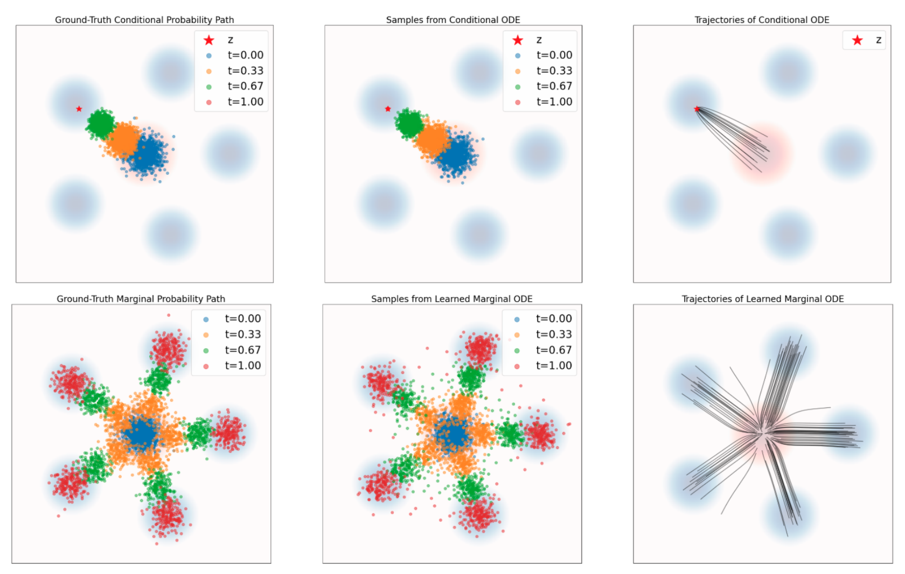

_Top: for one fixed $z$, the conditional ODE follows the conditional probability path and every trajectory ends at $z$. Bottom: the marginal ODE follows the full marginal probability path and transports noise toward every mode of the data distribution without requiring a data-point label. Source: Figure 6 of the [lecture notes](assets/course-mit-diffusion-2026/lecture-notes.pdf)._

For any sampled data point $z$, both $u_t^{\mathrm{target}}(x\mid z)$ and $p_t(x\mid z)$ are easy to compute. The marginal field, however, requires the posterior average

$$
u_t^{\mathrm{target}}(x)
=
\int u_t^{\mathrm{target}}(x\mid z)
\frac{p_t(x\mid z)p_{\mathrm{data}}(z)}{p_t(x)}\,dz,
\qquad
p_t(x)=\int p_t(x\mid z)p_{\mathrm{data}}(z)\,dz.
$$

The data distribution is normally available only through samples, not as a density that can be integrated analytically. Computing $p_t(x)$ would therefore require averaging $p_t(x\mid z)$ over every possible clean data point $z$; the same problem makes the posterior weights and the exact marginal field intractable. Conditional flow matching avoids evaluating any of these integrals: it trains on sampled $z$ using the easy conditional target, and the network learns the marginal field by averaging across training examples.

### The Divergence Operator

A vector field $v:\mathbb R^d\to\mathbb R^d$ assigns a vector $v(x)$ to every point $x$. Its **divergence** is the scalar

$$
\operatorname{div}(v)(x)
=
\sum_{i=1}^d
\frac{\partial v^i(x)}{\partial x_i}.
\tag{22}
$$

It measures local net outflow. Positive divergence means that more of the field flows out of a tiny region around $x$ than flows in; negative divergence means net inflow.

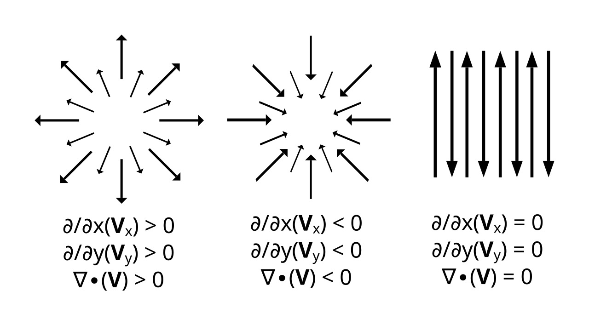

_Positive divergence behaves locally like a source, negative divergence like a sink, and zero divergence means no net local expansion or compression; it does not necessarily mean no motion. Diagram by Bfoshizzle1, via [Wikimedia Commons](https://commons.wikimedia.org/wiki/File:Divergence_(captions).svg), licensed under [CC BY-SA 4.0](https://creativecommons.org/licenses/by-sa/4.0/)._

In one dimension there is only one component, so divergence is simply the ordinary spatial derivative

$$
\operatorname{div}(v)(x)=\frac{dv(x)}{dx}.
$$

For example, if $v(x)$ increases with $x$, the arrow at the right side of a small interval is larger than the arrow at the left side: more flows out than in, so the divergence is positive. The continuity equation applies this idea to the flow of probability.

For more visual explanations, see Khan Academy's articles on [divergence](https://www.khanacademy.org/math/multivariable-calculus/multivariable-derivatives/divergence-and-curl-articles/a/divergence) and the [intuition behind the divergence formula](https://www.khanacademy.org/math/multivariable-calculus/multivariable-derivatives/divergence-and-curl-articles/a/intuition-for-divergence-formula).

### The Continuity Equation

**Continuity equation.** Consider a flow model with vector field $u_t^{\mathrm{target}}$ and

$$
X_0\sim p_{\mathrm{init}}=p_0.
$$

Then $X_t\sim p_t$ for every $0\leq t\leq1$ if and only if

$$
\boxed{
\partial_t p_t(x)
=
-\operatorname{div}\!\left(p_tu_t^{\mathrm{target}}\right)(x)
}.
\tag{23}
$$

where $\partial_t p_t(x)=\frac{d}{dt}p_t(x)$ is the time derivative of the density at $x$. This is the **continuity equation**.

The left-hand side describes how much the probability density at $x$ changes over time. This change must equal the net inflow of probability mass. A particle $X_t$ follows the vector field $u_t^{\mathrm{target}}$, while divergence measures net outflow. Therefore, negative divergence measures net inflow.

The velocity must also be weighted by how much probability is present. The product $p_tu_t^{\mathrm{target}}$ is the probability flow: a region containing more probability transports more probability at the same velocity. Thus $-\operatorname{div}(p_tu_t^{\mathrm{target}})(x)$ is the net inflow of probability mass at $x$. Since probability mass is conserved, it must equal $\partial_t p_t(x)$.

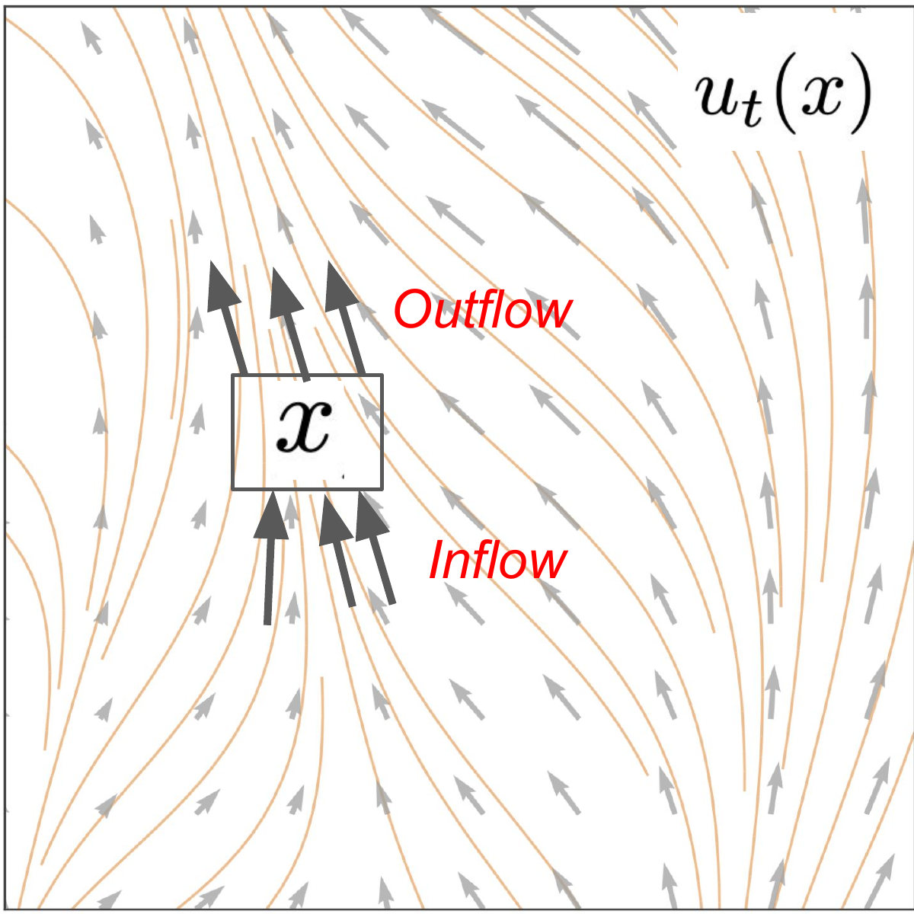

_The small box around $x$ gains or loses probability according to the balance between flow entering and leaving it. In the continuity equation, that flow is the probability current $p_tu_t$. Source: [Lecture 2 slides](assets/course-mit-diffusion-2026/lecture-02-flow-matching.pdf#page=20), slide 20._

#### The Fokker-Planck Equation

The continuity equation describes how a probability density evolves under the deterministic motion of an ODE. The **Fokker-Planck equation** generalizes it to the SDE

$$
X_0\sim p_{\mathrm{init}},
\qquad
dX_t=u_t(X_t)\,dt+\sigma_t\,dW_t,
$$

whose density evolves according to

$$
\boxed{
\partial_t p_t(x)
=
-\operatorname{div}(p_tu_t)(x)
+
\frac{\sigma_t^2}{2}\Delta p_t(x)
}.
\tag{108}
$$

There are now two ways for the density to change:

- The drift $u_t$ transports probability, giving the same $-\operatorname{div}(p_tu_t)$ term as in the continuity equation.
- Brownian noise spreads probability into nearby locations, giving the diffusion term $\frac{\sigma_t^2}{2}\Delta p_t$. The **Laplacian**

  $$
  \Delta p_t(x)
  =
  \sum_{i=1}^d\frac{\partial^2p_t(x)}{\partial x_i^2}
  =
  \operatorname{div}(\nabla p_t)(x)
  =
  \operatorname{tr}\!\left(\nabla_x^2p_t(x)\right)
  $$

  is simultaneously the **divergence of the gradient** and the **trace of the Hessian**. To see the first equality, recall that for a vector field $v:\mathbb R^d\to\mathbb R^d$,

  $$
  \operatorname{div}v(x)
  =
  \sum_{i=1}^d\frac{\partial v_i(x)}{\partial x_i}.
  $$

  The $i$th component of the gradient is $(\nabla p_t)_i=\partial p_t/\partial x_i$. Substituting $v=\nabla p_t$ therefore gives

  $$
  \operatorname{div}(\nabla p_t)(x)
  =
  \sum_{i=1}^d
  \frac{\partial}{\partial x_i}
  \left(
  \frac{\partial p_t(x)}{\partial x_i}
  \right)
  =
  \sum_{i=1}^d
  \frac{\partial^2p_t(x)}{\partial x_i^2}.
  $$

  The Hessian $\nabla_x^2p_t(x)$ contains every second partial derivative. Its diagonal entries are exactly $\partial^2p_t/\partial x_i^2$, and the trace adds those diagonal entries, giving the same sum.

  Thus the Laplacian adds the density's curvature along every coordinate. At a local peak it is typically negative, so diffusion lowers the density; at a local dip it is typically positive, so diffusion raises the density. In this way, the Laplacian describes probability spreading from concentrated regions into their surroundings.

When $\sigma_t=0$, no random noise is added and the diffusion term disappears. The Fokker-Planck equation then reduces exactly to the continuity equation.

The formal proof of the Fokker-Planck equation, including the continuity equation as its deterministic special case, is in [Appendix B](assets/course-mit-diffusion-2026/lecture-notes.pdf#page=72).

#### Proof That the Marginal Vector Field Generates the Marginal Probability Path

Recall that averaging the conditional probability paths over data points gives the [marginal probability path](#conditional-and-marginal-probability-paths)

$$
p_t(x)
=
\int p_t(x\mid z)p_{\mathrm{data}}(z)\,dz,
$$

and averaging their conditional velocities according to the posterior $p_t(z\mid x)$ gives the [marginal vector field](#the-marginalization-trick)

$$
u_t^{\mathrm{target}}(x)
=
\int u_t^{\mathrm{target}}(x\mid z)p_t(z\mid x)\,dz
=
\int
u_t^{\mathrm{target}}(x\mid z)
\frac{p_t(x\mid z)p_{\mathrm{data}}(z)}{p_t(x)}\,dz.
$$

We want to prove that the ODE

$$
\frac{dX_t}{dt}=u_t^{\mathrm{target}}(X_t)
$$

actually moves samples through the marginal distributions $p_t$. In particular, it must turn $p_0=p_{\mathrm{init}}$ into $p_1=p_{\mathrm{data}}$. This is what turns the posterior-averaged field into an unconditional generative model rather than merely a formal average of conditional velocities.

The [continuity equation](#the-continuity-equation) gives the condition we need to check:

$$
\partial_t p_t(x)
=
-\operatorname{div}\!\left(p_tu_t^{\mathrm{target}}\right)(x).
$$

Each conditional pair $p_t(\cdot\mid z)$ and $u_t^{\mathrm{target}}(\cdot\mid z)$ already satisfies its own continuity equation. The calculation below averages those conditional equations over $z$ and shows that the result is exactly the marginal continuity equation:

$$
\begin{aligned}
\partial_t p_t(x)
&\overset{(i)}{=}
\partial_t\int p_t(x\mid z)p_{\mathrm{data}}(z)\,dz\\
&=
\int \partial_t p_t(x\mid z)p_{\mathrm{data}}(z)\,dz\\
&\overset{(ii)}{=}
-\int
\operatorname{div}\!\left(
p_t(\cdot\mid z)u_t^{\mathrm{target}}(\cdot\mid z)
\right)(x)
p_{\mathrm{data}}(z)\,dz\\
&\overset{(iii)}{=}
-\operatorname{div}\!\left(
\int
p_t(x\mid z)u_t^{\mathrm{target}}(x\mid z)p_{\mathrm{data}}(z)\,dz
\right)(x)\\
&\overset{(iv)}{=}
-\operatorname{div}\!\left(
p_t(x)
\int
u_t^{\mathrm{target}}(x\mid z)
\frac{p_t(x\mid z)p_{\mathrm{data}}(z)}{p_t(x)}\,dz
\right)(x)\\
&\overset{(v)}{=}
-\operatorname{div}\!\left(p_tu_t^{\mathrm{target}}\right)(x).
\end{aligned}
$$

In $(i)$ we used the [sampling definition of the marginal path](#conditional-and-marginal-probability-paths); in $(ii)$, the continuity equation for each conditional probability path $p_t(\cdot\mid z)$; in $(iii)$, linearity to exchange the integral and divergence; in $(iv)$, multiplication and division by $p_t(x)$; and in $(v)$, the [definition of the marginal vector field](#the-marginalization-trick). Therefore $u_t^{\mathrm{target}}$ satisfies the continuity equation and follows the marginal probability path, proving the [marginalization result](#the-marginalization-trick).

### Learning the Marginal Vector Field

_**TL;DR:** Marginal flow matching states the ideal learning problem but cannot be evaluated. Conditional flow matching is computable from individual training examples and has exactly the same population gradient._

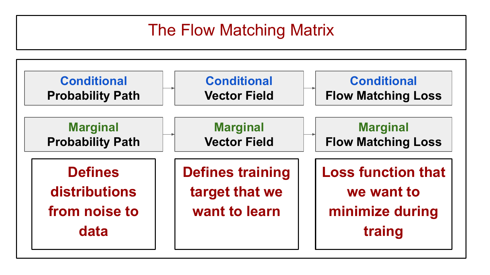

_The flow-matching construction has two rows. A probability path defines the distributions from noise to data; its vector field defines the target dynamics; and its loss trains the neural network. Source: [Lecture 2 slides](assets/course-mit-diffusion-2026/lecture-02-flow-matching.pdf#page=32), slide 32._

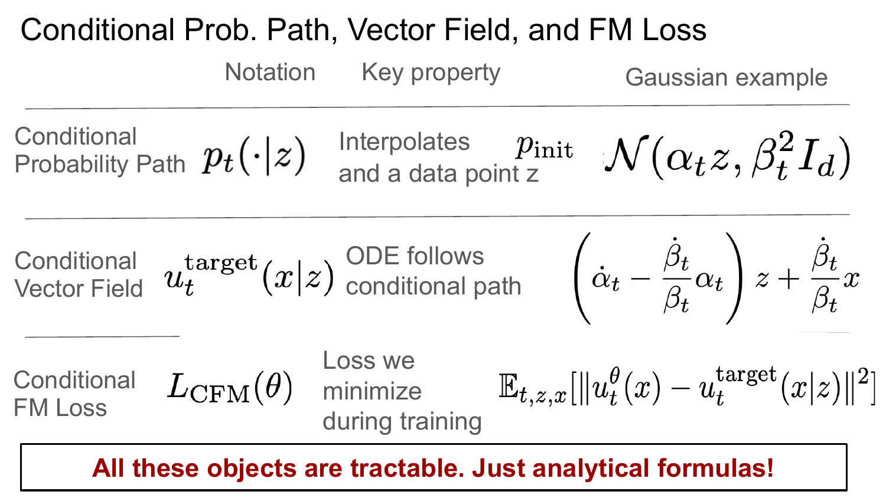

_Conditional probability path, vector field, and flow-matching loss. Source: [Lecture 2 slides](assets/course-mit-diffusion-2026/lecture-02-flow-matching.pdf#page=33), slide 33._

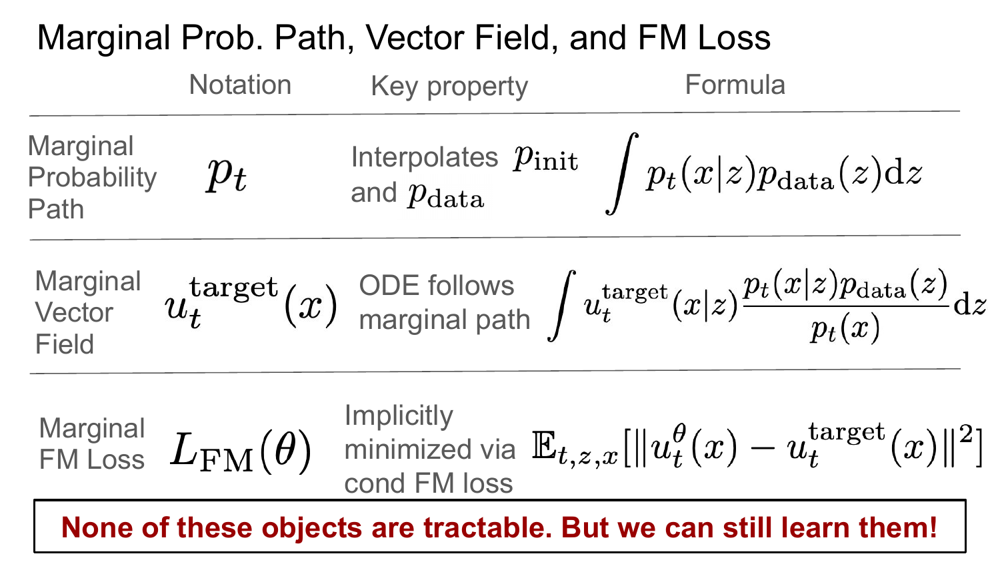

_Marginal probability path, vector field, and flow-matching loss. Source: [Lecture 2 slides](assets/course-mit-diffusion-2026/lecture-02-flow-matching.pdf#page=34), slide 34._

The two rows serve different purposes:

- The **marginal row** describes the distribution and vector field we actually want for generation, but evaluating its density, vector field, or loss requires intractable integrals over the data distribution.
- The **conditional row** fixes one sampled data point $z$. Its probability path, vector field, and loss all have tractable analytical formulas.

There is one useful nuance: although the marginal density $p_t(x)$ cannot generally be evaluated, sampling from it is easy. Draw $z\sim p_{\mathrm{data}}$ and then $x\sim p_t(\cdot\mid z)$.

#### The Ideal but Intractable Objective

Ideally, the neural network would directly match the marginal vector field:

$$
\mathcal L_{\mathrm{FM}}(\theta)
=
\mathbb E_{\substack{t\sim\operatorname{Unif}[0,1]\\x\sim p_t}}
\left[
\left\|u_t^\theta(x)-u_t^{\mathrm{target}}(x)\right\|^2
\right].
\tag{24}
$$

Samples from $p_t$ are easy to obtain by first sampling $z\sim p_{\mathrm{data}}$ and then $x\sim p_t(\cdot\mid z)$, so the same loss can be written as

$$
\mathcal L_{\mathrm{FM}}(\theta)
=
\mathbb E_{\substack{t\sim\operatorname{Unif}[0,1]\\z\sim p_{\mathrm{data}}\\x\sim p_t(\cdot\mid z)}}
\left[
\left\|u_t^\theta(x)-u_t^{\mathrm{target}}(x)\right\|^2
\right].
\tag{25}
$$

The remaining obstacle is the label $u_t^{\mathrm{target}}(x)$: the [marginalization formula](#the-marginalization-trick) requires an intractable integral over the data distribution. Thus we can sample the input $x$, but we cannot compute the marginal velocity that should label it.

#### The Tractable Objective

The tractable alternative is the **conditional flow matching loss**

$$
\boxed{
\mathcal L_{\mathrm{CFM}}(\theta)
=
\mathbb E_{\substack{t\sim\operatorname{Unif}[0,1]\\z\sim p_{\mathrm{data}}\\x\sim p_t(\cdot\mid z)}}
\left[
\left\|u_t^\theta(x)-u_t^{\mathrm{target}}(x\mid z)\right\|^2
\right]
}.
\tag{26}
$$

| | Marginal flow matching | Conditional flow matching |
| --- | --- | --- |
| Regression target | Marginal velocity $u_t^{\mathrm{target}}(x)$ | Conditional velocity $u_t^{\mathrm{target}}(x\mid z)$ |
| Can the target be evaluated? | No: it requires the posterior average over the data distribution | Yes: it is known analytically for the sampled $z$ |
| Role | The ideal objective we want to minimize | The objective we can actually train with |
| Population result | Learns the marginal vector field directly | Learns the same marginal vector field through regression |

“Tractable” has a concrete meaning here: one training example can be produced by sampling $t$, sampling a dataset example $z$, sampling $x\sim p_t(\cdot\mid z)$, and evaluating $u_t^{\mathrm{target}}(x\mid z)$. This requires no evaluation of $p_{\mathrm{data}}(z)$, $p_t(x)$, or $p_t(z\mid x)$; no integral over the dataset; and no ODE simulation.

The network receives only $(x,t)$, not $z$. The sampled $z$ is used to construct the input and its target. Because the network does not know which $z$ produced $x$, squared-error regression forces it to average the compatible conditional velocities.

#### Why Conditional Flow Matching Learns the Marginal Vector Field

The key result is that the marginal and conditional flow-matching losses differ only by a constant that does not depend on $\theta$:

$$
\mathcal L_{\mathrm{FM}}(\theta)
=
\mathcal L_{\mathrm{CFM}}(\theta)+C.
$$

Consequently, their gradients are equal, so minimizing the tractable conditional loss also minimizes the intractable marginal loss. The lecture notes prove this by expanding the marginal mean-squared error into three terms:

$$
\begin{aligned}
\mathcal L_{\mathrm{FM}}(\theta)
&=
\mathbb E_{\substack{t\sim\operatorname{Unif}[0,1]\\x\sim p_t}}
\left[
\left\|u_t^\theta(x)-u_t^{\mathrm{target}}(x)\right\|^2
\right]\\
&=
\mathbb E_{\substack{t\sim\operatorname{Unif}[0,1]\\x\sim p_t}}
\left[\left\|u_t^\theta(x)\right\|^2\right]
-2\mathbb E_{\substack{t\sim\operatorname{Unif}[0,1]\\x\sim p_t}}
\left[u_t^\theta(x)^Tu_t^{\mathrm{target}}(x)\right]
+
\underbrace{
\mathbb E_{\substack{t\sim\operatorname{Unif}[0,1]\\x\sim p_t}}
\left[\left\|u_t^{\mathrm{target}}(x)\right\|^2\right]
}_{C_1}\\
&=
\mathbb E_{\substack{t\sim\operatorname{Unif}[0,1]\\z\sim p_{\mathrm{data}}\\x\sim p_t(\cdot\mid z)}}
\left[\left\|u_t^\theta(x)\right\|^2\right]
-2\mathbb E_{\substack{t\sim\operatorname{Unif}[0,1]\\x\sim p_t}}
\left[u_t^\theta(x)^Tu_t^{\mathrm{target}}(x)\right]
+C_1.
\end{aligned}
$$

The second line uses $\lVert a-b\rVert^2=\lVert a\rVert^2-2a^Tb+\lVert b\rVert^2$. The final term is called $C_1$ because it does not depend on $\theta$. In the last line, the first expectation is rewritten using the sampling procedure for the marginal path.

The crucial remaining step is rewriting the cross term that contains the intractable marginal vector field. Substitute the [posterior average that defines the marginal vector field](#the-marginalization-trick):

$$
\begin{aligned}
&\mathbb E_{\substack{t\sim\operatorname{Unif}[0,1]\\x\sim p_t}}
\left[u_t^\theta(x)^Tu_t^{\mathrm{target}}(x)\right]\\
&=
\int_0^1\!\int
p_t(x)u_t^\theta(x)^Tu_t^{\mathrm{target}}(x)\,dx\,dt\\
&=
\int_0^1\!\int
p_t(x)u_t^\theta(x)^T
\left[
\int
u_t^{\mathrm{target}}(x\mid z)
\frac{p_t(x\mid z)p_{\mathrm{data}}(z)}{p_t(x)}\,dz
\right]dx\,dt\\
&=
\int_0^1\!\int\!\int
u_t^\theta(x)^Tu_t^{\mathrm{target}}(x\mid z)
p_t(x\mid z)p_{\mathrm{data}}(z)
\,dz\,dx\,dt\\
&=
\mathbb E_{\substack{t\sim\operatorname{Unif}[0,1]\\z\sim p_{\mathrm{data}}\\x\sim p_t(\cdot\mid z)}}
\left[u_t^\theta(x)^Tu_t^{\mathrm{target}}(x\mid z)\right].
\end{aligned}
$$

This equality is the heart of the proof: its left side uses the marginal vector field, while its right side uses the tractable conditional vector field. Substitute it back into the expanded marginal loss, then add and subtract the squared norm of the conditional vector field:

$$
\begin{aligned}
\mathcal L_{\mathrm{FM}}(\theta)
&=
\mathbb E_{\substack{t\sim\operatorname{Unif}[0,1]\\z\sim p_{\mathrm{data}}\\x\sim p_t(\cdot\mid z)}}
\left[
\left\|u_t^\theta(x)\right\|^2
-2u_t^\theta(x)^Tu_t^{\mathrm{target}}(x\mid z)
\right]+C_1\\
&=
\mathbb E_{\substack{t\sim\operatorname{Unif}[0,1]\\z\sim p_{\mathrm{data}}\\x\sim p_t(\cdot\mid z)}}
\left[
\left\|u_t^\theta(x)-u_t^{\mathrm{target}}(x\mid z)\right\|^2
-\left\|u_t^{\mathrm{target}}(x\mid z)\right\|^2
\right]+C_1\\
&=
\mathcal L_{\mathrm{CFM}}(\theta)
+
\underbrace{
\mathbb E_{\substack{t\sim\operatorname{Unif}[0,1]\\z\sim p_{\mathrm{data}}\\x\sim p_t(\cdot\mid z)}}
\left[-\left\|u_t^{\mathrm{target}}(x\mid z)\right\|^2\right]
}_{C_2}
+C_1\\
&=
\mathcal L_{\mathrm{CFM}}(\theta)+C,
\qquad C=C_1+C_2.
\end{aligned}
$$

Both $C_1$ and $C_2$ are independent of $\theta$. Therefore,

$$
\nabla_\theta\mathcal L_{\mathrm{CFM}}(\theta)
=
\nabla_\theta\mathcal L_{\mathrm{FM}}(\theta).
$$

Thus conditional flow matching and direct flow matching have the same population gradient and the same minimizers. CFM is not an approximation to the marginal objective: it is the tractable loss whose parameter-dependent part is exactly the same.

The lecture notes emphasize three striking features of this training algorithm:

- **Simulation-free:** We never actually simulate any ODE during training. This makes training extremely cheap because we do not have to roll out ODE trajectories, which take many steps.
- **Similar to supervised learning:** Training is a simple regression objective against $u_t^{\mathrm{target}}(x\mid z)$.
- **Extremely simple algorithm:** It is hard to think of a much simpler training objective. This makes flow matching especially appealing for large-scale machine-learning models.

#### What Is Used at Generation Time

After training, generation uses the learned marginal field:

$$
X_0\sim p_{\mathrm{init}},
\qquad
dX_t=u_t^\theta(X_t)\,dt.
\tag{27}
$$

Numerically solving this ODE from $t=0$ to $t=1$ produces the generated sample $X_1$.

### Gaussian and CondOT Flow Matching

For the Gaussian conditional path, sample

$$
z\sim p_{\mathrm{data}},
\qquad
\epsilon\sim\mathcal N(0,I_d),
\qquad
x_t=\alpha_tz+\beta_t\epsilon.
\tag{28}
$$

The [Gaussian conditional vector field derived above](#gaussian-conditional-vector-field-and-its-derivation-example-10), evaluated at this sampled $x_t$, is

$$
u_t^{\mathrm{target}}(x_t\mid z)
=
\dot\alpha_tz+\dot\beta_t\epsilon.
$$

Therefore, Gaussian conditional flow matching trains on

$$
\boxed{
\mathcal L_{\mathrm{CFM}}(\theta)
=
\mathbb E_{\substack{t\sim\operatorname{Unif}[0,1]\\z\sim p_{\mathrm{data}}\\\epsilon\sim\mathcal N(0,I_d)}}
\left[
\left\|
u_t^\theta(x_t)
-(\dot\alpha_tz+\dot\beta_t\epsilon)
\right\|^2
\right]
}.
\tag{31}
$$

For the [straight-line CondOT schedule derived above](#gaussian-conditional-vector-field-and-its-derivation-example-10), this becomes

$$
x_t=tz+(1-t)\epsilon,
\qquad
u_t^{\mathrm{target}}(x_t\mid z)=z-\epsilon,
$$

and the objective becomes

$$
\boxed{
\mathcal L_{\mathrm{CFM}}(\theta)
=
\mathbb E_{\substack{t\sim\operatorname{Unif}[0,1]\\z\sim p_{\mathrm{data}}\\\epsilon\sim\mathcal N(0,I_d)}}
\left[
\left\|u_t^\theta(x_t)-(z-\epsilon)\right\|^2
\right]
}.
$$

The input is a linear interpolation of noise and data, and the target is the constant velocity from that noise sample to that data sample.

### Flow Matching Training Procedure

For the Gaussian CondOT path, one training step is:

1. Sample a data example $z$ from the dataset.
2. Sample $t\sim\operatorname{Unif}[0,1]$.
3. Sample $\epsilon\sim\mathcal N(0,I_d)$.
4. Form $x_t=tz+(1-t)\epsilon$.
5. Compute $\|u_t^\theta(x_t)-(z-\epsilon)\|^2$ and update $\theta$.

These steps instantiate the simulation-free regression objective described above. ODE simulation is needed only after training, when generation starts from fresh Gaussian noise and follows the learned marginal field to $t=1$.

The lecture highlights Stable Diffusion 3 and Meta Movie Gen as large-scale examples trained with flow-matching-style objectives. Their architectures and datasets are much more elaborate, but the basic training signal is the regression objective above.

### Flow Matching Summary

Flow matching separates the construction into tractable conditional objects and useful marginal objects:

1. Choose $p_t(x\mid z)$, a conditional probability path from noise to one data point $z$.
2. Derive $u_t^{\mathrm{target}}(x\mid z)$, a tractable conditional vector field that follows that path.
3. Train $u_t^\theta(x)$ with conditional flow matching. Although the targets depend on sampled $z$, the network learns the marginal field because squared-error regression averages over compatible data points.
4. Generate by sampling $X_0\sim p_{\mathrm{init}}$ and solving $dX_t=u_t^\theta(X_t)\,dt$ to $t=1$.

For the Gaussian CondOT path, the complete training pair is simply

$$
\boxed{
x_t=tz+(1-t)\epsilon,
\qquad
\text{target}=z-\epsilon
}.
$$

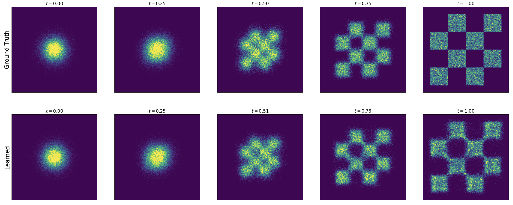

_The ground-truth marginal path (top) and samples produced by the trained flow-matching ODE (bottom) closely agree. Source: Figure 7 of the [lecture notes](assets/course-mit-diffusion-2026/lecture-notes.pdf)._

## [Lecture3-A] Score Functions and Score Matching

### From Vector Fields to Score Functions

_**TL;DR:** A score tells us which local direction makes a point more likely. For a Gaussian probability path, the score, vector field, and denoiser are different parameterizations of the same information._

Lecture 2 built a generative model around the marginal vector field $u_t^{\mathrm{target}}(x)$. Diffusion models often describe the same probability path using its **score function** instead.

For any density $q(x)$, its score is

$$
\boxed{
\nabla_x \log q(x)
}.
$$

The gradient is with respect to the state $x$, not model parameters such as $\theta$. It is a vector with the same dimension as $x$.

The score points in the direction in which the log-density increases most rapidly. Since

$$
\nabla_x\log q(x)
=
\frac{\nabla_x q(x)}{q(x)},
$$

it points in the same direction as $\nabla_xq(x)$ wherever $q(x)>0$, but measures the increase relative to the current density. Near a high-density mode the arrows point inward; at the exact top of a smooth mode the score is zero.

  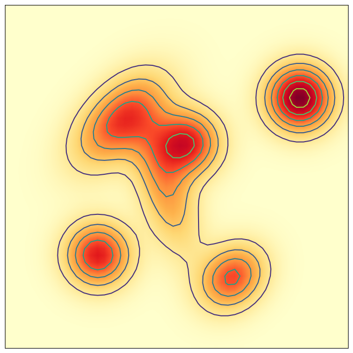
  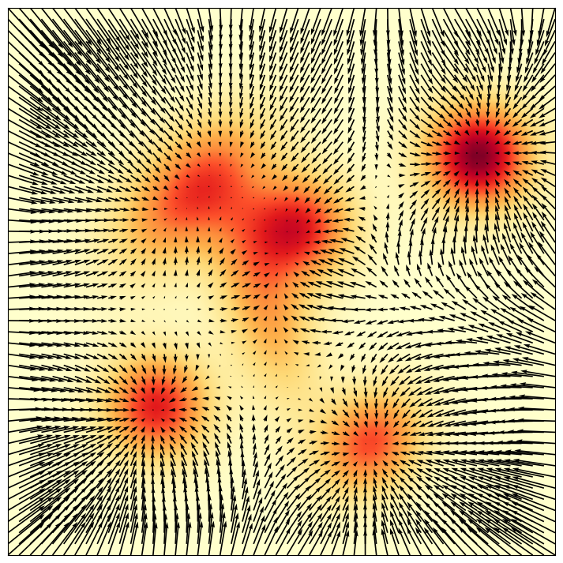

_A multimodal density $q(x)$ and its score field $\nabla\log q(x)$. Each arrow gives the locally steepest direction toward higher log-density. Source: Figure 8 of the [lecture notes](assets/course-mit-diffusion-2026/lecture-notes.pdf)._

### Conditional and Marginal Scores

As in [Lecture 2](#lecture2-flow-matching), begin with a conditional probability path $p_t(x\mid z)$ around one clean data point $z$, and marginalize over the data distribution:

$$
p_t(x)
=
\int p_t(x\mid z)\,p_{\mathrm{data}}(z)\,dz.
$$

The corresponding scores are:

$$
\begin{aligned}
\text{conditional score:}\qquad
&\nabla_x\log p_t(x\mid z),\\
\text{marginal score:}\qquad
&\nabla_x\log p_t(x).
\end{aligned}
$$

The conditional score is the local uphill direction if we know which clean endpoint $z$ generated the noisy point. The marginal score is the local uphill direction for the full mixture over all possible data points. The marginal score is what a generative model can use when $z$ is unknown at sampling time.

### The Marginal Score Is a Posterior Average

Recall that the [marginal vector field](#the-marginalization-trick) is the posterior average of the conditional vector fields:

$$
\boxed{
\begin{aligned}
u_t^{\mathrm{target}}(x)
&=
\int
u_t^{\mathrm{target}}(x\mid z)\,
\frac{p_t(x\mid z)p_{\mathrm{data}}(z)}
     {p_t(x)}
\,dz\\
&=
\mathbb E_{z\sim p_t(z\mid x)}
\left[
u_t^{\mathrm{target}}(x\mid z)
\right].
\end{aligned}
}
$$

The marginal score has exactly the same posterior-averaging structure:

$$
\boxed{
\begin{aligned}
\nabla_x\log p_t(x)
&=
\int
\nabla_x\log p_t(x\mid z)\,
\frac{p_t(x\mid z)p_{\mathrm{data}}(z)}
     {p_t(x)}
\,dz\\
&=
\int
\nabla_x\log p_t(x\mid z)\,
p_t(z\mid x)\,dz\\
&=
\mathbb E_{z\sim p_t(z\mid x)}
\left[
\nabla_x\log p_t(x\mid z)
\right].
\end{aligned}
}
$$

The only difference is the object being averaged: conditional velocities for the marginal vector field, and conditional scores for the marginal score.

- Each possible clean point $z$ proposes a conditional score $\nabla_x\log p_t(x\mid z)$.
- At the current noisy point $x$, some clean points are more plausible explanations than others.
- Weight each proposed score by $p_t(z\mid x)$, the posterior probability of that clean point given the current $x$, and average.

The weights cannot be just the global prior $p_{\mathrm{data}}(z)$. They must depend on the current location $x$. A clean point contributes strongly only when it is both common under the data distribution and capable of producing this particular $x$ under the corruption path. Bayes' rule gives exactly those local weights:

$$
p_t(z\mid x)
=
\frac{p_t(x\mid z)p_{\mathrm{data}}(z)}{p_t(x)}.
$$

The denominator $p_t(x)$ normalizes the contributions from all possible $z$ values so that the posterior weights integrate to one.

**Derivation.** Differentiate the marginal density directly:

$$
\begin{aligned}
\nabla_x\log p_t(x)
&=
\frac{\nabla_xp_t(x)}{p_t(x)}\\
&=
\frac{
\int \nabla_xp_t(x\mid z)p_{\mathrm{data}}(z)\,dz
}{
p_t(x)
}\\
&=
\int
\frac{\nabla_xp_t(x\mid z)}{p_t(x\mid z)}
\frac{p_t(x\mid z)p_{\mathrm{data}}(z)}{p_t(x)}
\,dz\\
&=
\int
\nabla_x\log p_t(x\mid z)\,
\frac{p_t(x\mid z)p_{\mathrm{data}}(z)}
     {p_t(x)}
\,dz.
\end{aligned}
$$

The two ingredients are $\nabla\log p=(\nabla p)/p$ and moving the gradient through the integral over $z$.

### Score of a Gaussian Probability Path

For the Gaussian conditional path

$$
p_t(x\mid z)
=
\mathcal N\left(x;\alpha_tz,\beta_t^2I_d\right)
=
\frac{1}{(2\pi)^{d/2}\beta_t^d}
\exp\left(
-\frac{1}{2\beta_t^2}
\left\|x-\alpha_tz\right\|^2
\right),
$$

the full log-density is

$$
\log p_t(x\mid z)
=
\log\mathcal N\left(x;\alpha_tz,\beta_t^2I_d\right)
=
-\frac{d}{2}\log(2\pi)
-d\log\beta_t
-
\frac{1}{2\beta_t^2}
\left\|x-\alpha_tz\right\|^2,
$$

where $d$ is the dimension of $x$. The first two terms are constant with respect to $x$, so only the squared-distance term contributes to the gradient. Differentiating gives

$$
\boxed{
\nabla_x\log p_t(x\mid z)
=
-\frac{x-\alpha_tz}{\beta_t^2}
}.
$$

The numerator points from the current point $x$ toward the Gaussian mean $\alpha_tz$. The factor $1/\beta_t^2$ sets the strength:

- Small variance means the density is sharply concentrated, so moving away from its mean causes a steep drop and the score has large magnitude.
- Large variance means the density is broad, so the same displacement changes log-density less and the score is weaker.
- At $x=\alpha_tz$, the point is at the conditional mode and the score is zero.

### Converting Between the Score and Vector Field

**Key observation.** For a Gaussian probability path, both the conditional score and the conditional vector field are linear functions of $x$ and $z$. They therefore contain the same information with different time-dependent coefficients, which is what makes it possible to convert between them.

**Proposition 1 (Conversion Formula for Gaussian Probability Paths).** For the Gaussian probability path $p_t(x\mid z)=\mathcal N(\alpha_tz,\beta_t^2I_d)$, the conditional and marginal vector fields are related to their corresponding scores by

$$
\boxed{
\begin{aligned}
u_t^{\mathrm{target}}(x\mid z)
&=
a_t\nabla_x\log p_t(x\mid z)+b_tx,\\
u_t^{\mathrm{target}}(x)
&=
a_t\nabla_x\log p_t(x)+b_tx,
\end{aligned}
}
$$

where

$$
a_t
=
\beta_t^2\frac{\dot\alpha_t}{\alpha_t}
-
\beta_t\dot\beta_t,
\qquad
b_t
=
\frac{\dot\alpha_t}{\alpha_t}.
$$

Thus, the conditional or marginal vector field can be recovered from the corresponding score, and vice versa.

**Proof.** As discussed earlier under [Gaussian Conditional Vector Field and Its Derivation](#gaussian-conditional-vector-field-and-its-derivation-example-10), start from

$$
x_t
=
\alpha_tz+\beta_t\epsilon,
\qquad
\epsilon=\frac{x_t-\alpha_tz}{\beta_t}.
$$

Holding $z$ and $\epsilon$ fixed while differentiating, and then writing the current $x_t$ as $x$,

$$
\begin{aligned}
u_t^{\mathrm{target}}(x\mid z)
&=
\frac{dx_t}{dt}\\
&=
\dot\alpha_tz+\dot\beta_t\epsilon\\
&=
\dot\alpha_tz
+
\frac{\dot\beta_t}{\beta_t}
\left(x-\alpha_tz\right)\\
&=
\left(
\dot\alpha_t
-
\frac{\dot\beta_t}{\beta_t}\alpha_t
\right)z
+
\frac{\dot\beta_t}{\beta_t}x.
\end{aligned}
$$

For comparison, write the conditional score in the same linear form:

$$
\nabla_x\log p_t(x\mid z)
=
\frac{\alpha_t}{\beta_t^2}z
-
\frac{1}{\beta_t^2}x
$$

To expose the score term $\alpha_tz-x$, first rewrite

$$
z
=
\frac{(\alpha_tz-x)+x}{\alpha_t}.
$$

Substitute this identity into the conditional vector field and simplify:

$$
\begin{aligned}
u_t^{\mathrm{target}}(x\mid z)
&=
\left(
\dot\alpha_t
-
\frac{\dot\beta_t}{\beta_t}\alpha_t
\right)z
+
\frac{\dot\beta_t}{\beta_t}x\\
&=
\left(
\frac{\dot\alpha_t}{\alpha_t}
-
\frac{\dot\beta_t}{\beta_t}
\right)
\bigl((\alpha_tz-x)+x\bigr)
+
\frac{\dot\beta_t}{\beta_t}x\\
&=
\left(
\frac{\dot\alpha_t}{\alpha_t}
-
\frac{\dot\beta_t}{\beta_t}
\right)
(\alpha_tz-x)
+
\frac{\dot\alpha_t}{\alpha_t}x\\
&=
\left(
\beta_t^2\frac{\dot\alpha_t}{\alpha_t}
-
\beta_t\dot\beta_t
\right)
\frac{\alpha_tz-x}{\beta_t^2}
+
\frac{\dot\alpha_t}{\alpha_t}x\\
&=
\underbrace{
\left(
\beta_t^2\frac{\dot\alpha_t}{\alpha_t}
-
\beta_t\dot\beta_t
\right)
}_{a_t}
\nabla_x\log p_t(x\mid z)
+
\underbrace{
\frac{\dot\alpha_t}{\alpha_t}
}_{b_t}x.
\end{aligned}
$$

This proves the conversion formula between the conditional vector field and conditional score. To derive the corresponding formula for the marginal vector field and marginal score, start from the [marginal vector field](#the-marginalization-trick) and posterior-average the conditional formula:

$$
\begin{aligned}
u_t^{\mathrm{target}}(x)
&\overset{\text{marginalization trick}}{=}
\int
u_t^{\mathrm{target}}(x\mid z)
p_t(z\mid x)\,dz\\
&\overset{\text{conditional conversion formula}}{=}
\int
\left[
a_t\nabla_x\log p_t(x\mid z)+b_tx
\right]
p_t(z\mid x)\,dz\\
&\overset{\text{linearity of integration}}{=}
a_t
\underbrace{
\int
\nabla_x\log p_t(x\mid z)
p_t(z\mid x)\,dz
}_{\substack{\text{posterior-average score}\\=\nabla_x\log p_t(x)}}
+
b_tx
\underbrace{
\int p_t(z\mid x)\,dz
}_{\substack{\text{posterior normalization}\\=1}}\\
&=
a_t\nabla_x\log p_t(x)+b_tx.
\end{aligned}
$$

**This is the main bridge between flow and diffusion parameterizations for a Gaussian path.** If a model has learned the **marginal vector field, it can recover the marginal score, and vice versa**. Early diffusion models commonly learned the score and converted it into the dynamics needed for sampling.

### The Denoiser as a Posterior Mean

> **Remark: Reparameterization of the Score.**
>
> The [conversion formula above](#converting-between-the-score-and-vector-field) for Gaussian probability paths is possible because both sides (conditional vector field and conditional score) are linear functions of $x$ and $z$. Once we marginalize (marginal vector field and marginal score), both sides are just a linear reparameterization of the posterior mean $\mathbb E_{z\mid x}[z]$. It follows that any quantity that allows to recover $\mathbb E_{z\mid x}[z]$ can in turn be used to recover the unconditional vector field and score. Further, doing so might even be preferable from a numerical/training stability standpoint. One common choice is the posterior mean itself, often referred to as the denoiser.
>
> The denoiser has a very intuitive interpretation: it is the expected value of clean data $z$ given noisy data $x$. People often call such models **denoising diffusion models**, as learning $D_t$ and learning $u_t^{\mathrm{target}}$ are theoretically equivalent.

Formally, we define the conditional and marginal denoiser as

$$
D_t(x\mid z)
=
z,
\qquad
D_t(x)
=
\int
D_t(x\mid z)\,
\frac{p_t(x\mid z)p_{\mathrm{data}}(z)}{p_t(x)}
\,dz
\overset{D_t(x\mid z)=z}{=}
\int
z\,
\frac{p_t(x\mid z)p_{\mathrm{data}}(z)}{p_t(x)}
\,dz
\overset{\text{Bayes' rule}}{=}
\int z\,p_t(z\mid x)\,dz
\overset{\text{definition of posterior mean}}{=}
\mathbb E_{z\mid x}[z].
$$

For a Gaussian probability path, the same denoiser can be recovered from the marginal vector field. Start by posterior-averaging the conditional vector field, then solve for $D_t(x)$:

$$
\begin{aligned}
u_t^{\mathrm{target}}(x)
&\overset{\text{marginalization trick}}{=}
\int u_t^{\mathrm{target}}(x\mid z)p_t(z\mid x)\,dz\\
&\overset{\text{Gaussian conditional vector field}}{=}
\int
\left[
\left(
\dot\alpha_t-\frac{\dot\beta_t}{\beta_t}\alpha_t
\right)z
+
\frac{\dot\beta_t}{\beta_t}x
\right]
p_t(z\mid x)\,dz\\
&\overset{\mathbb E_{z\mid x}[z]=D_t(x),\ \int p_t(z\mid x)dz=1}{=}
\left(
\dot\alpha_t-\frac{\dot\beta_t}{\beta_t}\alpha_t
\right)D_t(x)
+
\frac{\dot\beta_t}{\beta_t}x,
\end{aligned}
$$

so

$$
\begin{aligned}
\beta_tu_t^{\mathrm{target}}(x)
&=
(\dot\alpha_t\beta_t-\alpha_t\dot\beta_t)D_t(x)
+
\dot\beta_tx,\\
\beta_tu_t^{\mathrm{target}}(x)-\dot\beta_tx
&=
(\dot\alpha_t\beta_t-\alpha_t\dot\beta_t)D_t(x),\\
D_t(x)
&=
\frac{
\beta_tu_t^{\mathrm{target}}(x)-\dot\beta_tx
}{
\dot\alpha_t\beta_t-\alpha_t\dot\beta_t
}.
\end{aligned}
$$

- **What $\mathbb E_{z\mid x}[z]$ means.** Fix the current noisy point $x$. The posterior $p_t(z\mid x)$ assigns probability to each uncorrupted data point $z$ according to how plausibly it could have produced $x$. Its posterior mean is

  $$
  \mathbb E_{z\mid x}[z]
  \overset{\text{definition of posterior mean}}{=}
  \int z\,p_t(z\mid x)\,dz
  \overset{\text{Bayes' rule}}{=}
  \int
  z\,
  \frac{p_t(x\mid z)p_{\mathrm{data}}(z)}{p_t(x)}
  \,dz
  \overset{\text{definition of }D_t}{=}
  D_t(x).
  $$

  The expectation averages over possible $z$ values; the observed $x$ is held fixed.

- **Why the posterior mean of the uncorrupted data point $z$ is called the denoiser.** Given the noisy point $x$, a denoiser must choose one estimate $d$ of $z$. Under squared error, the posterior mean $\mathbb E_{z\mid x}[z]$ is the optimal choice:

  $$
  D_t(x)
  =
  \underset{d}{\operatorname{argmin}}
  \,\mathbb E_{z\mid x}
  \left[\lVert d-z\rVert^2\right].
  $$

  If $m=\mathbb E_{z\mid x}[z]$, then

  $$
  \mathbb E_{z\mid x}\left[\lVert d-z\rVert^2\right]
  =
  \lVert d-m\rVert^2
  +
  \mathbb E_{z\mid x}\left[\lVert z-m\rVert^2\right].
  $$

  The second term does not depend on $d$, so the loss is minimized at $d=m=D_t(x)$. Thus the posterior mean is the best mean-squared-error reconstruction of the clean data, which is why it is called the denoiser.

- **Will the denoiser always output a “clean” data point?** No. The denoiser returns the posterior mean, not a sample from the posterior. For example, if two distinct clean points are equally plausible,

  $$
  p_t(z\mid x)
  =
  \frac{1}{2}\delta_{z_1}
  +
  \frac{1}{2}\delta_{z_2}
  \qquad\Longrightarrow\qquad
  D_t(x)
  =
  \frac{z_1+z_2}{2}.
  $$

  The average may lie between the two data modes and need not itself resemble valid data; for images, this can appear as a blurry or implausible reconstruction. Whether the exact denoiser is clean-looking depends mainly on the noise level, how concentrated or multimodal $p_t(z\mid x)$ is, the geometry of the data distribution, and any conditioning information that narrows the posterior. A learned denoiser can additionally depart from the exact posterior mean because of finite data, model capacity, or optimization error.

- **Why the choice can still matter numerically.** The parameterizations are equivalent only if the predicted function is exact. With a finite neural network, finite precision, and optimization error, their scales can differ greatly across time. For example, the conditional score $-(x-\alpha_tz)/\beta_t^2=-\epsilon/\beta_t$ grows as $\beta_t\to0$, while converting a denoiser into a score multiplies denoiser error by $\alpha_t/\beta_t^2$. Other conversions divide by $\alpha_t$ or $\dot\alpha_t\beta_t-\alpha_t\dot\beta_t$, so small denominators can amplify error near an endpoint. Predicting $D_t(x)$ keeps the regression target on the scale of the data, but it induces a different effective weighting across noise levels. Thus, theoretically equivalent targets can have meaningfully different optimization and numerical stability.

| Conditional object: $z$ is a fixed, known, uncorrupted data point | Formula | Intuition |
| --- | --- | --- |
| **Probability path** | $p_t(x\mid z)$ | A **distribution over possible $x$** at time $t$, conditioned on one known data point $z$. It specifies where the population should be at each time. |
| **Vector field** | $\frac{dX_t}{dt}=u_t^{\mathrm{target}}(X_t\mid z)\ \Rightarrow\ X_t\sim p_t(\cdot\mid z)$ | The **instantaneous velocity of a point at $x$**. Its ODE realizes the conditional probability path associated with the known $z$. |
| **Denoiser** | $D_t(x\mid z)=z$ | The **data-point estimate**. Because $z$ is already given, denoising is trivial: return $z$. |

After $z$ is marginalized out, the corresponding objects are:

| Marginal object: $z$ is unknown | Formula | Intuition |
| --- | --- | --- |
| **Probability path** | $p_t(x)=\int p_t(x\mid z)p_{\mathrm{data}}(z)\,dz$ | A **distribution over the whole population of $x$** at time $t$, obtained by mixing the conditional paths for all possible data points. |
| **Vector field** | $u_t^{\mathrm{target}}(x)=\int u_t^{\mathrm{target}}(x\mid z)p_t(z\mid x)\,dz$ | The **instantaneous velocity at $x$**, obtained by averaging the conditional velocities according to which data points are plausible given the current $x$. |
| **Denoiser** | $D_t(x)=\int D_t(x\mid z)p_t(z\mid x)\,dz=\int z\,p_t(z\mid x)\,dz$ | The **posterior mean of the data points** that could have produced the current $x$. |

For the Gaussian path, posterior-averaging the conditional score gives

$$
\nabla_x\log p_t(x)
=
\frac{\alpha_tD_t(x)-x}{\beta_t^2},
$$

and therefore

$$
\boxed{
D_t(x)
=
\frac{x+\beta_t^2\nabla_x\log p_t(x)}{\alpha_t}
}.
$$

For Gaussian probability paths, the marginal score, marginal vector field, and denoiser are therefore linear reparameterizations of the same posterior information. Choosing which one a neural network predicts can still matter for numerical conditioning and training stability, even though they are equivalent in theory.

At the end of this section, the three equivalent views are:

$$
\boxed{
\text{score}
\quad\longleftrightarrow\quad
\text{vector field}
\quad\longleftrightarrow\quad
\text{denoiser}
}
\qquad
\text{for Gaussian probability paths.}
$$

### Sampling with SDEs

_**TL;DR:** The score lets us add Brownian noise to the learned ODE while preserving the same marginal probability path. Setting the diffusion coefficient to zero recovers deterministic ODE sampling; a positive coefficient produces stochastic trajectories._

Suppose the marginal vector field follows the desired probability path:

$$
\frac{dX_t}{dt}
=
u_t^{\mathrm{target}}(X_t),
\qquad
X_t\sim p_t.
$$

For any time-dependent diffusion coefficient $\sigma_t\geq0$, we can instead use the SDE

$$
\boxed{
\begin{aligned}
dX_t
&=
u_t^{\mathrm{target}}(X_t)\,dt
+
\frac{\sigma_t^2}{2}\nabla_x\log p_t(X_t)\,dt
+
\sigma_t\,dW_t\\
&=
\left[
u_t^{\mathrm{target}}(X_t)
+
\frac{\sigma_t^2}{2}\nabla_x\log p_t(X_t)
\right]dt
+
\sigma_t\,dW_t
\end{aligned}
},
\qquad
X_t\sim p_t.
$$

In particular, the endpoint still has the desired data distribution:

$$
X_1\sim p_{\mathrm{data}}.
$$

The three terms play different roles:

- $u_t^{\mathrm{target}}(X_t)dt$ performs the original deterministic transport along the probability path.
- $\sigma_t\,dW_t$ injects fresh Brownian noise and makes individual trajectories stochastic.
- $\frac{\sigma_t^2}{2}\nabla_x\log p_t(X_t)dt$ points toward higher-density regions and exactly compensates for the distributional spreading caused by the Brownian noise.

The coefficient $\sigma_t$ controls the amount of stochasticity. When $\sigma_t=0$, the SDE reduces to the original ODE. Increasing $\sigma_t$ makes individual trajectories more jagged, but in the exact continuous-time theory it does not change their marginal distribution at any time.

> **Note: Langevin dynamics.** Suppose the target distribution is fixed over time:
> $$
> p_t=p
> \qquad\Longrightarrow\qquad
> \partial_t p_t=0.
> $$
> The [continuity equation](#the-continuity-equation) therefore requires
> $$
> 0
> =
> -\operatorname{div}\!\left(p\,u_t^{\mathrm{target}}\right).
> $$
> This does **not** require $u_t^{\mathrm{target}}=0$: a nonzero vector field could circulate probability while leaving the density $p$ unchanged. For Langevin dynamics, we choose the simplest valid field,
> $$
> u_t^{\mathrm{target}}=0.
> $$
> The SDE then reduces to
> $$
> dX_t
> =
> \frac{\sigma_t^2}{2}\nabla_x\log p(X_t)\,dt
> +
> \sigma_t\,dW_t.
> $$
> This is **Langevin dynamics**. The general SDE above combines this score-directed stochastic motion with the vector field that transports the changing probability path $p_t$. For the Gaussian special case, cf. the earlier [Ornstein-Uhlenbeck process](#ornstein-uhlenbeck-process) section.

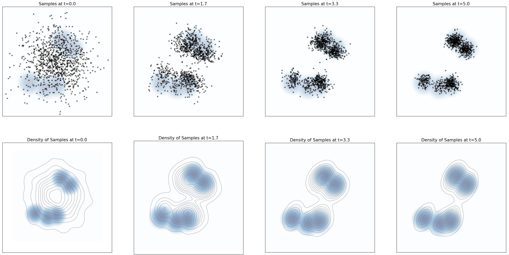

_Langevin dynamics moves an initially diffuse collection of particles toward a fixed multimodal target distribution. Source: Figure 10 of the [lecture notes](assets/course-mit-diffusion-2026/lecture-notes.pdf)._

#### Why the Marginal Probability Path Stays the Same

The [earlier Fokker-Planck section](#the-fokker-planck-equation) defines the Laplacian, explains the SDE generalization of the continuity equation, and links its full derivation in Appendix B. The result needed here is: for the SDE

$$
X_0\sim p_{\mathrm{init}},
\qquad
dX_t=f_t(X_t)\,dt+\sigma_t\,dW_t,
$$

$X_t$ has distribution $p_t$ for every $0\leq t\leq1$ if and only if

$$
\partial_t p_t(x)
=
-\operatorname{div}(p_tf_t)(x)
+
\frac{\sigma_t^2}{2}\Delta p_t(x).
$$

This is a generic statement about an SDE with drift $f_t$. For the proposed sampler, the complete drift is

$$
f_t(x)
=
u_t^{\mathrm{target}}(x)
+
\frac{\sigma_t^2}{2}\nabla_x\log p_t(x),
$$

so the score term is included inside $f_t$. The ODE and SDE share the same proposed probability path $p_t$, but they have **different dynamics**:

$$
\begin{aligned}
\text{ODE:}\quad
&dX_t=u_t^{\mathrm{target}}(X_t)\,dt,\\
\text{SDE:}\quad
&dX_t=
\underbrace{\left[
u_t^{\mathrm{target}}(X_t)
+
\frac{\sigma_t^2}{2}\nabla_x\log p_t(X_t)
\right]dt}_{\text{drift}}
+
\underbrace{\sigma_t\,dW_t}_{\text{diffusion}}.
\end{aligned}
$$

The path $p_t$ is not being derived here. It is already known to be generated by the original ODE, so it satisfies the [continuity equation](#the-continuity-equation):

$$
\partial_t p_t
=
-\operatorname{div}(p_tu_t^{\mathrm{target}}).
$$

The remaining question is whether the proposed SDE also has this same $p_t$. The Fokker-Planck equation provides the test: substitute the SDE drift $f_t$ and check whether the already-known $p_t$ satisfies it. Following the direction of the proof in the lecture notes, begin with the known continuity equation and rewrite it into Fokker-Planck form.

$$
\begin{aligned}
\partial_t p_t
&=
-\operatorname{div}(p_tu_t^{\mathrm{target}})
&&\text{(continuity equation)}\\
&=
-\operatorname{div}(p_tu_t^{\mathrm{target}})
-
\frac{\sigma_t^2}{2}\Delta p_t
+
\frac{\sigma_t^2}{2}\Delta p_t
&&\text{(add and subtract the same term)}\\
&=
-\operatorname{div}(p_tu_t^{\mathrm{target}})
-
\frac{\sigma_t^2}{2}\operatorname{div}(\nabla_x p_t)
+
\frac{\sigma_t^2}{2}\Delta p_t
&&\left(
\Delta p_t
=
\sum_{i=1}^d\frac{\partial^2p_t}{\partial x_i^2}
=
\operatorname{div}(\nabla p_t),
\ \text{see Laplacian section earlier}
\right)\\
&=
-\operatorname{div}(p_tu_t^{\mathrm{target}})
-
\operatorname{div}\!\left(
p_t\frac{\sigma_t^2}{2}\nabla_x\log p_t
\right)
+
\frac{\sigma_t^2}{2}\Delta p_t
&&\text{($\nabla p_t=p_t\nabla\log p_t$)}\\
&=
-\operatorname{div}\!\left[
p_t\left(
u_t^{\mathrm{target}}
+
\frac{\sigma_t^2}{2}\nabla_x\log p_t
\right)
\right]
+
\frac{\sigma_t^2}{2}\Delta p_t
&&\text{(linearity of divergence)}\\
&=
-\operatorname{div}(p_tf_t)
+
\frac{\sigma_t^2}{2}\Delta p_t
&&\text{(definition of $f_t$)}.
\end{aligned}
$$

The first line is the known rate of change of $p_t$ under the ODE. The last line is exactly the Fokker-Planck equation for the proposed SDE. Therefore, the same candidate $p_t$ satisfies the SDE's required density-evolution equation. By the Fokker-Planck result above, this means that the SDE has distribution $p_t$ at every time.

**The added score drift and Brownian diffusion cancel only at the level of the population density. They do not cancel along each sample trajectory.** Over a small step $h$,

$$
X_{t+h}
\approx
X_t
+
\left[
u_t^{\mathrm{target}}(X_t)
+
\frac{\sigma_t^2}{2}\nabla_x\log p_t(X_t)
\right]h
+
\sigma_t\sqrt{h}\,\epsilon,
\qquad
\epsilon\sim\mathcal N(0,I_d).
$$

The random $O(\sqrt h)$ displacement makes an SDE trajectory zig-zag even though the collection of trajectories still has distribution $p_t$ at every time.

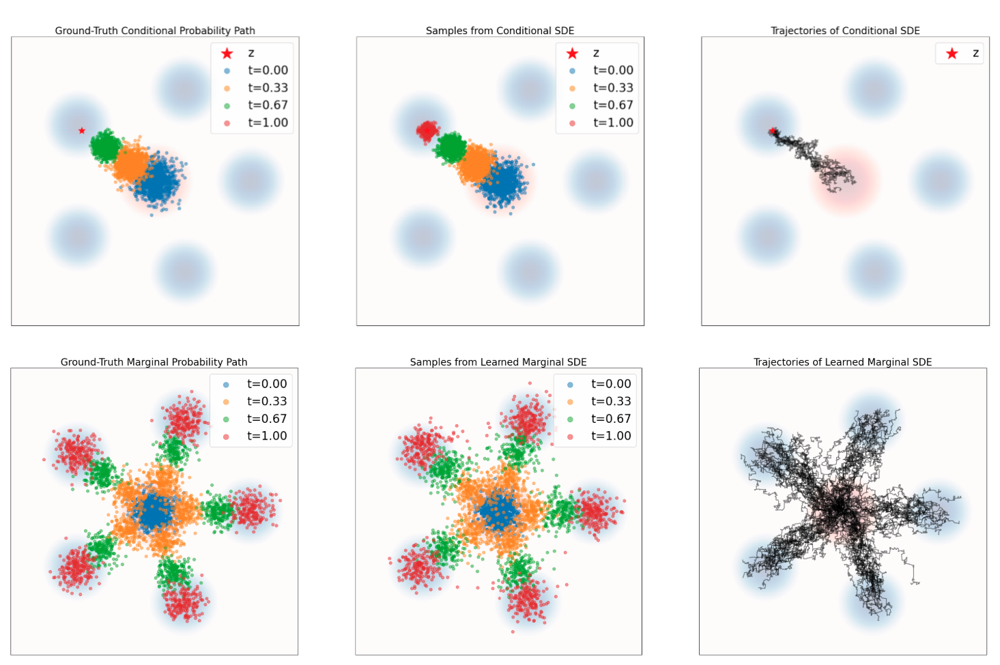

_The SDE samples match the same conditional and marginal probability paths as their ODE counterparts, but individual trajectories are stochastic and jagged. Source: Figure 9 of the [lecture notes](assets/course-mit-diffusion-2026/lecture-notes.pdf)._

For a Gaussian probability path, the [score-vector-field conversion](#converting-between-the-score-and-vector-field)

$$
u_t^{\mathrm{target}}(x)
=
a_t\nabla_x\log p_t(x)+b_tx
$$

lets us write the SDE entirely in terms of the score:

$$
\begin{aligned}
dX_t
&=
u_t^{\mathrm{target}}(X_t)\,dt
+
\frac{\sigma_t^2}{2}\nabla_x\log p_t(X_t)\,dt
+
\sigma_t\,dW_t\\
&=
\left[
a_t\nabla_x\log p_t(X_t)
+
b_tX_t
\right]dt
+
\frac{\sigma_t^2}{2}\nabla_x\log p_t(X_t)\,dt
+
\sigma_t\,dW_t\\
&=
\left[
\left(a_t+\frac{\sigma_t^2}{2}\right)
\nabla_x\log p_t(X_t)
+
b_tX_t
\right]dt
+
\sigma_t\,dW_t.
\end{aligned}
$$

Thus a separately trained score network is not theoretically necessary for a Gaussian path if the marginal vector field has already been learned.

#### Is Stochastic Sampling Better?

Not automatically. As the SDE extension establishes, **the SDE has the same marginal distribution $p_t$ at every time as the original ODE, even though their individual trajectories differ.** The result is striking because we can choose any diffusion coefficient $\sigma_t\geq0$, even after training the networks. In theory, the result holds for every choice of $\sigma_t$.

In practice, however, we suffer from two sources of error:

1. **Training error:** The neural network does not perfectly approximate the marginal vector field and score.
2. **Simulation error:** Numerically discretizing the ODE or SDE introduces error. For example, when $\sigma_t\gg0$, prohibitively small step sizes may be needed.

For a fixed trained model, there is therefore often an empirically optimal $\sigma_t\geq0$.

_The existence of a “best” $\sigma_t$ is an artifact of imperfectly trained models and finite compute budgets, not a theoretical property of the exact continuous-time dynamics._

Some downstream procedures, including search, fine-tuning, and inference-time optimization, may benefit from continued stochastic evolution. Nevertheless, the [lecture slides](assets/course-mit-diffusion-2026/lecture-03-score-matching-and-guidance.pdf#page=21) emphasize that ODE sampling often gives the best practical results: **SDE sampling is an option, not a requirement.**

#### Langevin Dynamics as a Sampler

For the Langevin special case defined above, the fixed target $p$ is a **stationary distribution**:

$$
X_0\sim p
\quad\Longrightarrow\quad
X_t\sim p
\qquad (t\geq0).
$$

More importantly for sampling, under suitable regularity and mixing conditions, Langevin dynamics can begin from another distribution $p'\neq p$ and converge toward $p$:

$$
X_0\sim p'
\quad\Longrightarrow\quad
p_t\longrightarrow p.
$$

An [Euler-Maruyama step](#simulating-an-sde-with-euler-maruyama) makes the mechanism concrete:

$$
X_{k+1}
=
X_k
+
\frac{\sigma_{t_k}^2}{2}
\nabla_x\log p(X_k)h
+
\sigma_{t_k}\sqrt h\,\epsilon_k,
\qquad
\epsilon_k\sim\mathcal N(0,I_d).
$$

Unlike ODE sampling, this uses fresh $\epsilon_k$ at every step. Continuous Langevin dynamics therefore provides a basis for MCMC: repeated local score-directed and random moves can converge to $p$ without requiring samples from $p$ initially. The Euler update approximates this process and requires a sufficiently small $h$; a fixed nonzero step size generally introduces some discretization bias.

For a Gaussian target $p=\mathcal N(0,I_d)$,

$$
\nabla_x\log p(x)=-x,
$$

so Langevin dynamics reduces to an [Ornstein-Uhlenbeck process](#ornstein-uhlenbeck-process):

$$
dX_t
=
\underbrace{
-\frac{\sigma_t^2}{2}X_t\,dt
}_{\text{linear mean-reverting drift toward zero}}
+
\underbrace{
\sigma_t\,dW_t
}_{\text{Brownian noise}}.
$$

An Ornstein-Uhlenbeck process is precisely this combination: the farther $X_t$ moves from zero, the stronger the linear drift pulling it back, while Brownian noise continually perturbs it.

This connection underlies early diffusion-model formulations. More generally, Langevin dynamics is widely used for molecular simulation and MCMC in Bayesian statistics. Early score-based generative models extended it across a sequence of noise levels, using annealed Langevin dynamics to move from an easy noisy distribution toward the data distribution.

#### Optional: GLASS Flows

The distinguishing feature of SDE sampling is that the initial point $X_0$ does not fully determine $X_t$ for $t>0$: fresh randomness enters throughout the evolution. Perhaps surprisingly, [GLASS Flows](https://arxiv.org/abs/2509.25170) can reproduce the same stochastic transitions using ODEs through an additional sampling construction. The aim is to retain stochastic capabilities, such as search over multiple continuations, while preserving the computational advantages of ODE sampling.

### Score Matching

_**TL;DR:** Directly regressing against the marginal score is intractable. Denoising score matching instead uses a tractable conditional score, yet learns the same marginal score. For the standard Gaussian probability path, this becomes noise prediction; after training, the predicted score or noise is converted into the vector field used by an ODE or SDE sampler._

#### The Learning Problem

The remaining task is to learn the marginal score $\nabla_x\log p_t(x)$.

Why learn it? If both the marginal vector field and marginal score are available, then for any chosen diffusion coefficient $\sigma_t\geq0$ we can use the [SDE extension derived above](#sampling-with-sdes):

$$
\boxed{X_0\sim p_{\mathrm{init}},\qquad dX_t=\left[u_t^{\mathrm{target}}(X_t)+\frac{\sigma_t^2}{2}\nabla_x\log p_t(X_t)\right]dt+\sigma_t\,dW_t.}
$$

With the exact vector field and score, this SDE has $X_t\sim p_t$ at every time and ends with $X_1\sim p_{\mathrm{data}}$. Trained approximations give an approximate sampler.

For a Gaussian probability path, the [score-vector-field conversion](#converting-between-the-score-and-vector-field) gives

$$
x_t=\alpha_tz+\beta_t\epsilon,\quad \epsilon\sim\mathcal N(0,I_d);\quad u_t^{\mathrm{target}}(x)=a_t\nabla_x\log p_t(x)+b_tx,\quad a_t=\beta_t^2\frac{\dot\alpha_t}{\alpha_t}-\beta_t\dot\beta_t,\quad b_t=\frac{\dot\alpha_t}{\alpha_t}.
$$

This means that we do not need separate vector-field and score networks. If we trained a vector-field model $u_t^\theta$, then $s_t^\theta(x)=(u_t^\theta(x)-b_tx)/a_t$. Substituting it into the general SDE gives the **vector-field-based formulation**

$$
\boxed{
\begin{aligned}
dX_t&=\left[u_t^\theta(X_t)+\frac{\sigma_t^2}{2a_t}\left(u_t^\theta(X_t)-b_tX_t\right)\right]dt+\sigma_t\,dW_t\\
&=\left[\left(1+\frac{\sigma_t^2}{2a_t}\right)u_t^\theta(X_t)-\frac{\sigma_t^2b_t}{2a_t}X_t\right]dt+\sigma_t\,dW_t.
\end{aligned}
}
$$

Alternatively, if we trained a score network $s_t^\theta$, substitute $u_t^\theta(x)=a_ts_t^\theta(x)+b_tx$ to obtain the equivalent **score-based formulation**

$$
\boxed{
\begin{aligned}
dX_t&=\left[a_ts_t^\theta(X_t)+b_tX_t+\frac{\sigma_t^2}{2}s_t^\theta(X_t)\right]dt+\sigma_t\,dW_t\\
&=\left[\left(a_t+\frac{\sigma_t^2}{2}\right)s_t^\theta(X_t)+b_tX_t\right]dt+\sigma_t\,dW_t.
\end{aligned}
}
$$

Setting $\sigma_t=0$ recovers the deterministic ODE in either parameterization. These conversions are special to Gaussian paths. For a general probability path, there may be no linear relationship between the marginal score and vector field, so introduce a time-conditioned score network $s_t^\theta:\mathbb R^d\to\mathbb R^d$ with $s_t^\theta(x)\approx\nabla_x\log p_t(x)$ directly.

The ideal **score matching loss** is

$$
\boxed{\mathcal L_{\mathrm{SM}}(\theta)=\mathbb E_{\substack{t\sim\operatorname{Unif}[0,1]\\x\sim p_t}}\left[\left\|s_t^\theta(x)-\nabla_x\log p_t(x)\right\|^2\right]}.
$$

We can sample $x\sim p_t$ by first sampling $z\sim p_{\mathrm{data}}$ and then $x\sim p_t(\cdot\mid z)$. The difficulty is evaluating the target. The marginal density $p_t(x)=\int p_t(x\mid z)p_{\mathrm{data}}(z)\,dz$ averages over the entire unknown data distribution, so neither $p_t(x)$ nor $\nabla_x\log p_t(x)$ is generally available at a sampled $x$.

#### Conditional Score Matching (Denoising Score Matching)

As in [conditional flow matching](#learning-the-marginal-vector-field), replace the intractable marginal target with the tractable conditional one:

$$
\boxed{\mathcal L_{\mathrm{CSM}}(\theta)=\mathbb E_{\substack{t\sim\operatorname{Unif}[0,1]\\z\sim p_{\mathrm{data}}\\x\sim p_t(\cdot\mid z)}}\left[\left\|s_t^\theta(x)-\nabla_x\log p_t(x\mid z)\right\|^2\right]}.
$$

This is the **conditional score matching loss**, commonly called the **denoising score matching loss** because the target is defined using a clean point and its corrupted version. It is tractable whenever we can sample from $p_t(x\mid z)$ and evaluate its conditional score. For a Gaussian path, this target reduces to predicting the injected noise, as derived below.

The target uses the sampled clean point $z$, but $z$ is not passed to the network. The network receives only $(x,t)$ and must learn the best prediction shared across all clean points that could have produced that $x$.

#### Why Conditional Score Matching Learns the Marginal Score

The [posterior-average identity derived earlier](#the-marginal-score-is-a-posterior-average) gives

$$
\mathbb E\!\left[\nabla_x\log p_t(X_t\mid Z)\mid X_t=x\right]=\nabla_x\log p_t(x).
$$

For compactness, write $m_t(x):=\nabla_x\log p_t(x)$ and $c_t(x,z):=\nabla_x\log p_t(x\mid z)$.

The claim is that the two losses differ only by a constant independent of $\theta$:

$$
\boxed{\mathcal L_{\mathrm{SM}}(\theta)=\mathcal L_{\mathrm{CSM}}(\theta)+C,\qquad C\text{ is independent of }\theta}
$$

The proof follows the same steps as the [conditional flow-matching derivation](#why-conditional-flow-matching-learns-the-marginal-vector-field). First expand the marginal loss, calling the final target-only term $C_1$:

$$
\begin{aligned}
\mathcal L_{\mathrm{SM}}(\theta)
&=\mathbb E_{t,x}\!\left[\|s_t^\theta(x)\|^2\right]
-2\mathbb E_{t,x}\!\left[s_t^\theta(x)^\top m_t(x)\right]+C_1,\\
C_1&=\mathbb E_{t,x}\!\left[\|m_t(x)\|^2\right].
\end{aligned}
$$

Here and below, $\mathbb E_{t,x}$ means $t\sim\operatorname{Unif}[0,1]$ and $x\sim p_t$. The first term can equivalently be sampled by drawing $z\sim p_{\mathrm{data}}$ and then $x\sim p_t(\cdot\mid z)$.

The crucial step is to rewrite the cross term using the posterior-average formula for the marginal score:

$$
\begin{aligned}
\mathbb E_{t,x}\!\left[s_t^\theta(x)^\top m_t(x)\right]
&=\mathbb E_{t,x}\!\left[s_t^\theta(x)^\top\int c_t(x,z)p_t(z\mid x)\,dz\right]\\
&=\mathbb E_{\substack{t\sim\operatorname{Unif}[0,1]\\z\sim p_{\mathrm{data}}\\x\sim p_t(\cdot\mid z)}}
\!\left[s_t^\theta(x)^\top c_t(x,z)\right],
\end{aligned}
$$

where the second equality uses Bayes' rule, $p_t(x)p_t(z\mid x)=p_t(x\mid z)p_{\mathrm{data}}(z)$. Substitute this into the expanded marginal loss and complete the square:

$$
\begin{aligned}
\mathcal L_{\mathrm{SM}}(\theta)
&=\mathbb E_{t,z,x}\!\left[\|s_t^\theta(x)\|^2-2s_t^\theta(x)^\top c_t(x,z)\right]+C_1\\
&=\mathbb E_{t,z,x}\!\left[\|s_t^\theta(x)-c_t(x,z)\|^2-\|c_t(x,z)\|^2\right]+C_1\\
&=\mathcal L_{\mathrm{CSM}}(\theta)+C_1+C_2
=\mathcal L_{\mathrm{CSM}}(\theta)+C,
\end{aligned}
$$

where $\mathbb E_{t,z,x}$ denotes the joint sampling procedure above and $C_2=-\mathbb E_{t,z,x}[\|c_t(x,z)\|^2]$. Both $C_1$ and $C_2$ are independent of $\theta$, so

$$
\nabla_\theta\mathcal L_{\mathrm{CSM}}(\theta)=\nabla_\theta\mathcal L_{\mathrm{SM}}(\theta).
$$

Thus conditional and marginal score matching have the same population gradient and minimizers. The tractable conditional target implicitly teaches the network the marginal score, with $s_t^{\theta^*}(x)=\nabla_x\log p_t(x)$ at the optimum.

#### Gaussian Probability Paths and Noise Prediction

A **Gaussian probability path** means that the distribution conditioned on one clean data point is Gaussian, equivalently sampled as

$$
\boxed{p_t(x\mid z)=\mathcal N\!\left(x;\alpha_tz,\beta_t^2I_d\right),\qquad X_t=\alpha_tZ+\beta_t\epsilon,\quad \epsilon\sim\mathcal N(0,I_d).}
$$

**This does not mean that the marginal $p_t(x)$ is Gaussian.** After averaging over $z\sim p_{\mathrm{data}}$, $p_t$ is generally a complicated Gaussian mixture. Gaussian conditional corruption is nevertheless the standard and most important continuous diffusion setting; the Gaussian CondOT path is the special case $\alpha_t=t$ and $\beta_t=1-t$.

The [conditional Gaussian score derived earlier](#score-of-a-gaussian-probability-path) is

$$
\begin{aligned}
\nabla_x\log p_t(x\mid z)
&=
-\frac{x-\alpha_tz}{\beta_t^2}\\
&\overset{x=\alpha_tz+\beta_t\epsilon}{=}
-\frac{\epsilon}{\beta_t}.
\end{aligned}
$$

Substituting this target into denoising score matching gives

$$
\begin{aligned}
\mathcal L_{\mathrm{CSM}}(\theta)
&=
\mathbb E_{t,z,\epsilon}
\left[
\left\|
s_t^\theta(x)
+
\frac{\epsilon}{\beta_t}
\right\|^2
\right]\\
&=
\mathbb E_{t,z,\epsilon}
\left[
\frac{1}{\beta_t^2}
\left\|
\beta_ts_t^\theta(x)
+
\epsilon
\right\|^2
\right].
\end{aligned}
$$

For each sampled training example, the score target is the negative injected noise scaled by $1/\beta_t$. This is the origin of the name **denoising diffusion model**.

There is one important regression subtlety. The network sees $(x_t,t)$, not the particular clean point $z$ or noise draw $\epsilon$. It generally cannot recover that exact $\epsilon$. Under squared error, the optimal network predicts its posterior mean: $s_t^{\theta^*}(x)=-\frac{1}{\beta_t}\mathbb E[\epsilon\mid X_t=x]=\nabla_x\log p_t(x)$.

#### Score Prediction Versus Noise Prediction

For a Gaussian path, define a noise-prediction network by $\epsilon_t^\theta(x)=-\beta_ts_t^\theta(x)$. Then score prediction and noise prediction contain the same information:

$$
\boxed{s_t^\theta(x)=-\frac{\epsilon_t^\theta(x)}{\beta_t}}.
$$

The raw score loss is poorly conditioned when $\beta_t\approx0$ because its target $-\epsilon/\beta_t$ and its weight $1/\beta_t^2$ become large. DDPM-style training therefore uses the reparameterized objective

$$
\boxed{\mathcal L_{\mathrm{DDPM}}(\theta)=\mathbb E_{t,z,\epsilon}\left[\left\|\epsilon_t^\theta(x)-\epsilon\right\|^2\right]}.
$$

The target $\epsilon\sim\mathcal N(0,I_d)$ has a stable scale at every noise level. Dropping the factor $1/\beta_t^2$ changes how different times are weighted during training, so the two practical objectives can behave differently even though their optimal predictions are algebraically convertible.

The score remains the fundamental distribution-level object:

- $\nabla_x\log p_t(x)$ is defined for any differentiable density, independently of how samples were corrupted.
- The auxiliary noise $\epsilon$ and the conversion $s=-\epsilon/\beta_t$ depend on the chosen Gaussian parameterization.
- The score appears directly in Langevin dynamics and in the [SDE sampler](#sampling-with-sdes). A model that predicts noise is converted back to a score whenever the sampler needs it.

For non-Gaussian probability paths, denoising score matching still applies if $\nabla_x\log p_t(x\mid z)$ is tractable, but there need not be an equivalent standardized-noise prediction target.

#### Score Matching Training Procedure

For a Gaussian path, one training step is:

1. Sample a data example $z\sim p_{\mathrm{data}}$.
2. Sample $t\sim\operatorname{Unif}[0,1]$.
3. Sample $\epsilon\sim\mathcal N(0,I_d)$.
4. Form $x_t=\alpha_tz+\beta_t\epsilon$.
5. Train with either $\left\|s_t^\theta(x_t)+\epsilon/\beta_t\right\|^2$ or $\left\|\epsilon_t^\theta(x_t)-\epsilon\right\|^2$.
6. Update $\theta$ by gradient descent.

As with flow matching, training is **simulation-free**: it samples independent points on the probability path and performs supervised regression. It does not run an ODE or SDE trajectory during training.

#### From a Learned Score to Samples

A score is local distributional information, not a sample by itself. Simply applying gradient ascent, $x\leftarrow x+\eta\nabla_x\log p_t(x)$, would move points toward modes and collapse diversity. Sampling instead places the learned score inside dynamics that transport an entire distribution.

For a Gaussian path, recover the learned marginal vector field through $u_t^\theta(x)=a_ts_t^\theta(x)+b_tx$.

Starting from $X_0\sim p_{\mathrm{init}}$, deterministic sampling solves

$$
dX_t=u_t^\theta(X_t)\,dt=\left[a_ts_t^\theta(X_t)+b_tX_t\right]dt.
$$

The stochastic alternative from [sampling with SDEs](#sampling-with-sdes) is

$$
dX_t=\left[\left(a_t+\frac{\sigma_t^2}{2}\right)s_t^\theta(X_t)+b_tX_t\right]dt+\sigma_t\,dW_t.
$$

At each numerical step, the sampler evaluates the network at the current $(X_t,t)$ and advances the ODE or SDE. If the network predicts noise, it first converts $s_t^\theta(X_t)=-\epsilon_t^\theta(X_t)/\beta_t$.

Repeated evaluations move an initial Gaussian sample through the learned probability path until the endpoint approximates $p_{\mathrm{data}}$.

#### Score Matching Summary

1. The useful target is the marginal score $\nabla_x\log p_t(x)$, but it is generally intractable.
2. Denoising score matching regresses against the tractable conditional score $\nabla_x\log p_t(x\mid z)$ and has the same population gradient as direct score matching.
3. For Gaussian conditional paths, the conditional score is $-\epsilon/\beta_t$, so score prediction can be reparameterized as noise prediction.
4. Noise prediction is usually better conditioned, while the score is the intrinsic distributional object used by the sampling dynamics.
5. After training, convert the learned score or noise prediction into the vector field and repeatedly integrate an ODE or SDE from noise to data.

## [Lecture3-B] Classifier-Free Guidance

### From Unconditional to Guided Generation

_**TL;DR:** Give the model a prompt $y$ so that it generates from $p_{\mathrm{data}}(\cdot\mid y)$ rather than the unconditional data distribution._

So far, the goal has been unconditional generation:

$$
X_1\sim p_{\mathrm{data}}.
$$

For a prompt, class label, or other condition $y\in\mathcal Y$, the desired distribution becomes

$$
X_1\sim p_{\mathrm{data}}(\cdot\mid y).
$$

The notes call this **guided** generation to avoid overloading “conditional.” Earlier, $p_t(x\mid z)$ meant a probability path conditioned on a clean training example $z$. Here, $p_{\mathrm{data}}(z\mid y)$ means the data distribution conditioned on a prompt or label $y$.

### Vanilla Guidance

_**TL;DR:** Pass $y$ to the same vector-field network during both training and sampling; otherwise, flow matching proceeds as before._

A guided vector-field network additionally receives $y$:

$$
u^\theta:\mathbb R^d\times\mathcal Y\times[0,1]\to\mathbb R^d,
\qquad
(x,y,t)\mapsto u_t^\theta(x\mid y).
$$

For a fixed prompt $y$, sample by simulating

$$
X_0\sim p_{\mathrm{init}},
\qquad
dX_t=u_t^\theta(X_t\mid y)\,dt+\sigma_t\,dW_t,
\qquad
\text{goal: }X_1\sim p_{\mathrm{data}}(\cdot\mid y).
$$

When $\sigma_t=0$, this is a guided flow model: the same prompt-conditioned field is integrated as an ODE.

Training uses paired examples $(z,y)$, such as an image and its caption. The guided conditional flow-matching loss is

$$
\boxed{
\mathcal L_{\mathrm{guided\text{-}CFM}}(\theta)
=
\mathbb E_{\substack{(z,y)\sim p_{\mathrm{data}}(z,y)\\t\sim\operatorname{Unif}[0,1]\\x\sim p_t(\cdot\mid z)}}
\left[
\left\|u_t^\theta(x\mid y)-u_t^{\mathrm{target}}(x\mid z)\right\|^2
\right].
}
$$

This differs from ordinary [conditional flow matching](#the-tractable-objective) only in two places:

- The dataset supplies a pair $(z,y)$ rather than only $z$.
- The model receives $y$, so it can learn a different marginal vector field for each prompt.

The analytic target $u_t^{\mathrm{target}}(x\mid z)$ does not need $y$: once the clean sample $z$ is fixed, the conditional probability path and its velocity are constructed exactly as before. Because the network sees $(x,t,y)$ but not $z$, squared-error regression averages the compatible targets for that particular prompt and learns the prompt-conditioned marginal field.

Vanilla guidance has no separate guidance scale or auxiliary classifier. It simply trains and samples a conditional model. In theory this should produce $p_{\mathrm{data}}(\cdot\mid y)$; in practice its samples may not follow the prompt strongly enough, which motivates classifier and classifier-free guidance in the next section.

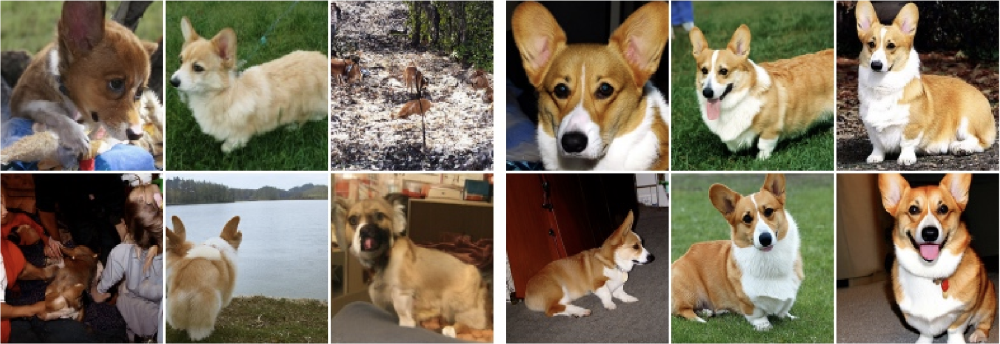

_For the prompt “corgi dog,” vanilla-guided samples on the left often fit the requested class poorly; CFG with $w=4$ on the right produces much more consistent corgis. Source: Figure 11 of the [lecture notes](assets/course-mit-diffusion-2026/lecture-notes.pdf), adapted from [Classifier-Free Diffusion Guidance](https://arxiv.org/abs/2207.12598)._

### Classifier Guidance

_**TL;DR:** Train a classifier on noisy inputs and use its gradient to strengthen the prompt-dependent part of the vector field._

Vanilla guidance can underemphasize the prompt because the model underfits or because the paired data is imperfect. Guidance deliberately strengthens the prompt-dependent part of the learned dynamics. The lecture first derives this idea using a classifier, then removes the classifier.

For a Gaussian probability path, the earlier [score-vector-field conversion](#converting-between-the-score-and-vector-field) also holds after conditioning on a prompt:

$$
u_t^{\mathrm{target}}(x\mid y)=a_t\nabla_x\log p_t(x\mid y)+b_tx.
$$

Apply Bayes' rule and differentiate with respect to $x$:

$$
\begin{aligned}
p_t(x\mid y)&=\frac{p_t(x)p_t(y\mid x)}{p_t(y)},\\
\nabla_x\log p_t(x\mid y)
&=\nabla_x\log p_t(x)+\nabla_x\log p_t(y\mid x).
\end{aligned}
$$

The term $\nabla_x\log p_t(y)$ vanishes because $p_t(y)$ does not depend on $x$. Substituting the score decomposition into the vector field gives

$$
\boxed{u_t^{\mathrm{target}}(x\mid y)=a_t\left[\nabla_x\log p_t(x)+\nabla_x\log p_t(y\mid x)\right]+b_tx=\left[a_t\nabla_x\log p_t(x)+b_tx\right]+a_t\nabla_x\log p_t(y\mid x)=u_t^{\mathrm{target}}(x)+a_t\nabla_x\log p_t(y\mid x).}
$$

The first term says how to generate a plausible sample without a prompt. The second points in the direction that makes the current noisy state more likely to be classified as $y$. **Classifier guidance** strengthens that prompt-dependent direction with a guidance scale $w>1$:

$$
\widetilde u_t(x\mid y)
=u_t^{\mathrm{target}}(x)+w a_t\nabla_x\log p_t(y\mid x).
$$

Classifier guidance has three drawbacks:

1. **It requires a separate classifier.** We must train a time-dependent classifier $p_t(y\mid x)$ on noisy inputs alongside the flow or diffusion model, giving us two networks instead of one.

2. **High-dimensional conditions are difficult.** If $y$ is a text prompt rather than a class label, learning $p_t(y\mid x)$ and obtaining $\nabla_x\log p_t(y\mid x)$ can be very hard.

3. **Guidance with $w>1$ is heuristic.** In that case $\widetilde u_t(x\mid y)\neq u_t^{\mathrm{target}}(x\mid y)$, so it is no longer the true guided vector field.

### Classifier-Free Guidance

_**TL;DR:** Learn both the prompt-conditioned and unconditional vector fields in one network, then extrapolate from the unconditional field toward the conditioned field during sampling._

#### Removing the Classifier

Bayes' rule also implies

$$
\nabla_x\log p_t(y\mid x)
=\nabla_x\log p_t(x\mid y)-\nabla_x\log p_t(x).
$$

Following the lecture notes, substitute this identity into classifier guidance, then add and subtract $b_tx$ inside the term multiplied by $w$ so that the Gaussian score-vector-field formulas appear:

$$
\begin{aligned}
\widetilde u_t(x\mid y)
&=u_t^{\mathrm{target}}(x)+wa_t\nabla_x\log p_t(y\mid x)\\
&=u_t^{\mathrm{target}}(x)+wa_t\left[\nabla_x\log p_t(x\mid y)-\nabla_x\log p_t(x)\right]\\
&=u_t^{\mathrm{target}}(x)+w\left[\left(b_tx+a_t\nabla_x\log p_t(x\mid y)\right)-\left(b_tx+a_t\nabla_x\log p_t(x)\right)\right]\\
&=u_t^{\mathrm{target}}(x)+w\left[u_t^{\mathrm{target}}(x\mid y)-u_t^{\mathrm{target}}(x)\right]\\
&=\boxed{(1-w)u_t^{\mathrm{target}}(x)+w u_t^{\mathrm{target}}(x\mid y)}.
\end{aligned}
$$

The classifier gradient has disappeared. We only need the unconditional and prompt-conditioned vector fields. This is **classifier-free guidance (CFG)**: “classifier-free” means that no separate classifier is trained.

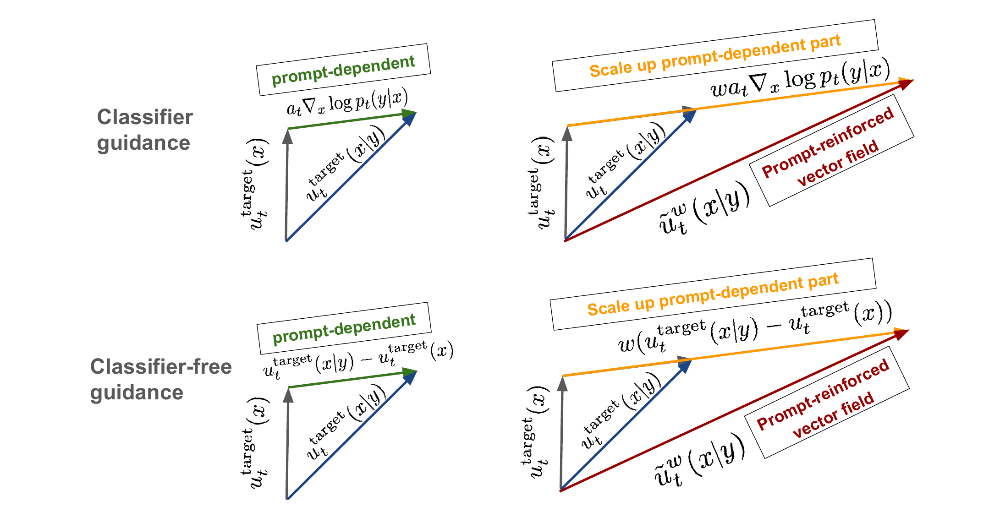

_Classifier guidance and classifier-free guidance reinforce the same prompt-dependent component in two different ways. Source: Figure 12 of the [lecture notes](assets/course-mit-diffusion-2026/lecture-notes.pdf)._

Although the classifier-based derivation used a Gaussian path, the final CFG combination

$$
\widetilde u_t(x\mid y)=(1-w)u_t^{\mathrm{target}}(x)+w u_t^{\mathrm{target}}(x\mid y)
$$

can be used with general probability paths. The Gaussian assumption is needed for the classifier interpretation, not for evaluating and combining two learned vector fields.

#### Training One Network for Both Fields

Use a special null condition $\varnothing$ and identify

$$
u_t^{\mathrm{target}}(x)=u_t^{\mathrm{target}}(x\mid\varnothing).
$$

During training, replace the real condition by $\varnothing$ with label-dropout probability $\eta$:

$$
y'=\begin{cases}
\varnothing,&\text{with probability }\eta,\\
y,&\text{with probability }1-\eta.
\end{cases}
$$

The CFG conditional flow-matching objective is then

$$
\boxed{
\mathcal L_{\mathrm{CFG\text{-}CFM}}(\theta)
=\mathbb E_{\substack{(z,y)\sim p_{\mathrm{data}}(z,y)\\t\sim\operatorname{Unif}[0,1]\\x\sim p_t(\cdot\mid z)\\y'\text{ obtained by label dropout}}}
\left[\left\|u_t^\theta(x\mid y')-u_t^{\mathrm{target}}(x\mid z)\right\|^2\right].
}
$$

The regression target is unchanged. Examples whose label is retained train the prompt-conditioned field; examples whose label is dropped train the unconditional field in the same network.

For a Gaussian path, one training example is especially simple:

1. Sample a paired example $(z,y)$, a time $t$, and $\epsilon\sim\mathcal N(0,I_d)$.
2. Form $x=\alpha_tz+\beta_t\epsilon$.
3. Replace $y$ by $\varnothing$ with probability $\eta$.
4. Minimize $\left\|u_t^\theta(x\mid y')-(\dot\alpha_tz+\dot\beta_t\epsilon)\right\|^2$.

The label-dropout probability $\eta$ is a training hyperparameter. It is distinct from the inference-time guidance scale $w$.

#### Sampling with CFG

At every ODE step, evaluate the same network twice:

$$
u_{\mathrm{uncond}}=u_t^\theta(x\mid\varnothing),
\qquad
u_{\mathrm{cond}}=u_t^\theta(x\mid y),
$$

then use

$$
\boxed{
\widetilde u_t^\theta(x\mid y)
=(1-w)u_{\mathrm{uncond}}+w u_{\mathrm{cond}}
=u_{\mathrm{uncond}}+w(u_{\mathrm{cond}}-u_{\mathrm{uncond}}).
}
$$

The cases are easy to interpret:

- $w=0$ gives unconditional generation.
- $w=1$ gives ordinary vanilla-guided generation.
- $w>1$ extrapolates beyond the conditional field, strengthening prompt adherence.

For $w>1$, this is not a convex average: the unconditional field has negative coefficient $1-w$. **CFG therefore no longer promises $X_1\sim p_{\mathrm{data}}(\cdot\mid y)$.** Nevertheless, it usually improves alignment with the condition and makes outputs more canonical, at the cost of diversity and potentially more artifacts. CFG is therefore a heuristic justified predominantly by its excellent empirical results. The lecture notes emphasize its practical importance: almost any AI-generated image or video relies heavily on CFG, often with guidance scale $w\geq4$.

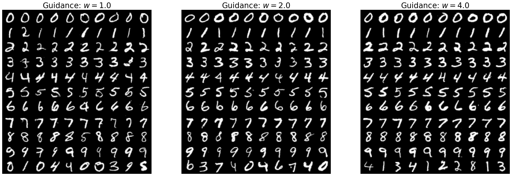

_Increasing the guidance scale makes the generated digits adhere more strongly to their requested class while reducing variation. Source: Figure 13 of the [lecture notes](assets/course-mit-diffusion-2026/lecture-notes.pdf)._

For a flow model, sampling integrates

$$
dX_t=\widetilde u_t^\theta(X_t\mid y)\,dt.
$$

For a diffusion model, use the same CFG-combined prediction in the corresponding [SDE sampler](#sampling-with-sdes). CFG changes the drift, score, or noise prediction used during sampling; the numerical ODE or SDE machinery remains the same.
